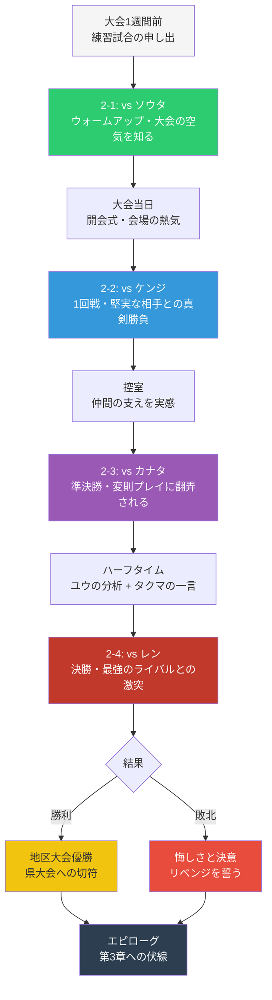
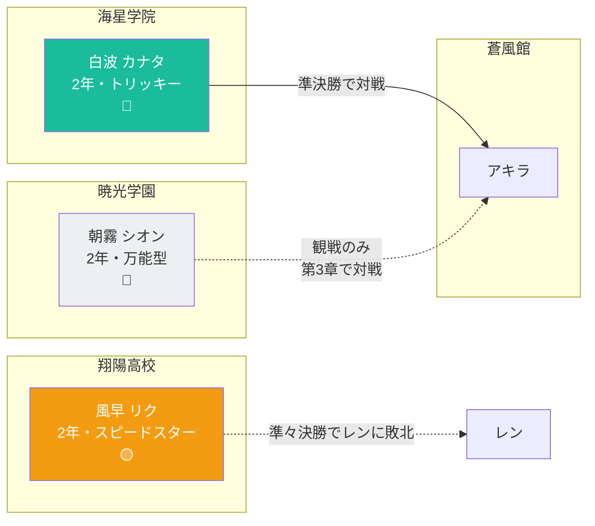
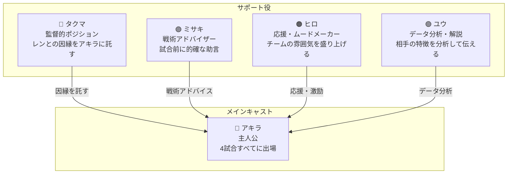
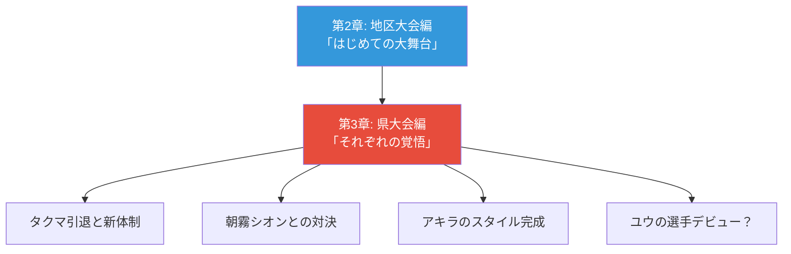

# 第2章プロット概要（D-03）

> Phase 0 成果物 — 第2章のストーリー構造・ステージ設計・新キャラクター概要
> 配置: `src/features/air-hockey/doc/world/chapter2-plot.md`

---

## 目次

1. [第2章 概要](#第2章-概要)
2. [ストーリー構造](#ストーリー構造)
3. [ステージ詳細](#ステージ詳細)
   - [ステージ 2-1: 嵐の前の一打](#ステージ-2-1-嵐の前の一打)
   - [ステージ 2-2: 堅実なる壁](#ステージ-2-2-堅実なる壁)
   - [ステージ 2-3: 幻惑の罠](#ステージ-2-3-幻惑の罠)
   - [ステージ 2-4: 氷の頂へ](#ステージ-2-4-氷の頂へ)
4. [新キャラクター概要](#新キャラクター概要)
5. [既存キャラクターの役割](#既存キャラクターの役割)
6. [感情曲線](#感情曲線)
7. [第3章へのフック](#第3章へのフック)

---

## 第2章 概要

| 項目 | 設定 |
|------|------|
| 章タイトル | **第2章「はじめての大舞台」** |
| 時期 | 6月（初夏） |
| テーマ | **挑戦と覚悟** — 仲間と共に初めての公式戦に挑むアキラの成長 |
| ステージ数 | 4ステージ |
| 舞台 | 地区大会（12-16校参加の個人戦トーナメント） |

### テーマの詳細

第1章で「部の仲間」を得たアキラが、第2章では「外の世界」と初めて向き合います。

- **内→外への転換**: 部内の練習相手から、他校の未知の強敵へ
- **個人→チームの意識**: 自分のためだけでなく、「蒼風館の代表」としての覚悟
- **壁の乗り越え方**: パワーでもテクニックでもなく、「自分のスタイル」を見つけること

---

## ストーリー構造

### 全体の流れ



### 三幕構成

| 幕 | ステージ | 内容 | 感情の方向 |
|----|---------|------|-----------|
| **第一幕（序）** | 2-1 | 練習試合で大会の緊張感を疑似体験。ソウタの楽天的な姿勢に触れ、肩の力が抜ける | 期待 → 安心 |
| **第二幕（破）** | 2-2, 2-3 | 大会本番。ケンジの堅実さ、カナタの変則プレイと、異なるタイプの壁にぶつかる。仲間の支えで乗り越える | 緊張 → 苦戦 → 覚醒 |
| **第三幕（急）** | 2-4 | 決勝でレンと対峙。タクマの因縁を引き継ぎ、アキラが「自分の一打」で決着をつける | 覚悟 → 激闘 → 達成/決意 |

---

## ステージ詳細

### ステージ 2-1: 嵐の前の一打

> _「おっ、蒼風館の人？ 一緒にやろうよ！」_

| 項目 | 設定 |
|------|------|
| ステージ ID | `2-1` |
| ステージ名 | 嵐の前の一打 |
| 対戦相手 | 春日 ソウタ（桜ヶ丘高校） |
| フィールド | `zigzag`（Zigzag）|
| 難易度 | Easy |
| 勝利スコア | 3 |
| 場面 | 大会1週間前、蒼風館の体育館に桜ヶ丘高校が練習試合に来訪 |

#### ストーリーの役割

- **導入**: 大会前の緊張をほぐすウォームアップ
- **ソウタの再登場**: フリー対戦の「ルーキー」が、ストーリー上のキャラとして再登場
- **新フィールド紹介**: Zigzag フィールドの障害物を体験させる
- **伏線**: ソウタから「黒鉄高校のレンってやつ、すごいらしいよ」という情報を聞く

#### ダイアログ概要

**試合前:**
- ソウタ「おっ、蒼風館の人？ 練習試合しようよ！」
- アキラ「はい、お願いします！」
- ユウ（解説）「桜ヶ丘高校のソウタ選手。公式戦の経験はまだ浅いけど、楽しんでプレイするタイプだね」
- ソウタ「あ、このコート障害物あるんだ。面白そう！」

**勝利後:**
- ソウタ「やっぱ強いなー！ さすが蒼風館！」
- ソウタ「あ、そうだ。黒鉄高校にレンってやつがいるんだけど、あいつヤバいよ。去年の県大会ベスト4だって」
- アキラ「レン…覚えておきます」
- ヒロ「レンか…タクマ先輩と因縁があるって聞いたことあるな」

**敗北後:**
- ソウタ「やったー！ 俺でも勝てるんだ！」
- ソウタ「でも本番はもっと気合い入ると思うから、次は負けないぞー」
- アキラ「…本番までに、もっと練習しないと」

#### AI バランス設計案

| パラメータ | 値 | 意図 |
|-----------|-----|------|
| maxSpeed | 1.5 | ソウタの成長を反映し、フリー対戦 Easy より少し速い |
| predictionFactor | 1 | 低い予測精度 |
| wobble | 30 | ブレは大きめだが、フリー対戦時より改善 |
| skipRate | 0.05 | 反応ミスは少なめ |
| centerWeight | 0.7 | 中央に寄りがち |
| wallBounce | false | 壁反射は使わない |
| アイテム出現間隔 | 通常 | 特別な補正なし |

---

### ステージ 2-2: 堅実なる壁

> _「蒼風館か…いい勝負をしよう」_

| 項目 | 設定 |
|------|------|
| ステージ ID | `2-2` |
| ステージ名 | 堅実なる壁 |
| 対戦相手 | 秋山 ケンジ（翠嶺学園） |
| フィールド | `fortress`（Fortress）|
| 難易度 | Normal |
| 勝利スコア | 5 |
| 場面 | 地区大会1回戦、公式試合会場の体育館 |

#### ストーリーの役割

- **初めての公式戦**: アキラにとって初めての大会試合。緊張と興奮を描く
- **ケンジの再登場**: フリー対戦の「レギュラー」がストーリーに登場
- **「基本の強さ」の壁**: 派手な技がなくとも、基本に忠実な相手の怖さを体験
- **Fortress フィールド**: 破壊可能な障害物のあるフィールドで新しい戦術を要求

#### ダイアログ概要

**試合前:**
- タクマ「アキラ、1回戦の相手は翠嶺学園の秋山だ。堅実なプレイヤーだ、油断するな」
- ケンジ「蒼風館か。噂は聞いてるよ。1年生がレギュラーなんだって？ いい勝負をしよう」
- アキラ「はい、全力でいきます！」
- ユウ（解説）「秋山ケンジ選手、2年生。派手さはないけど、隙が少ない堅実なスタイルだよ」
- ミサキ「守りの固い相手よ。焦らずに攻めなさい」

**勝利後:**
- ケンジ「…完敗だ。蒼風館、強いな」
- ケンジ「次は負けない。夏の大会で待ってる」
- アキラ「ありがとうございました！ いい試合でした！」
- ヒロ「1回戦突破！ この調子でいくぞ！」
- タクマ「…悪くない。だが次はもっと厳しい」

**敗北後:**
- ケンジ「いい試合だった。お互いまだまだ伸びるよ」
- アキラ「…基本って、こんなに強いんだ」
- タクマ「基本を甘く見るな。お前に足りないのは、そこだ」

#### AI バランス設計案

| パラメータ | 値 | 意図 |
|-----------|-----|------|
| maxSpeed | 3.5 | 中程度の速さ、フリー対戦 Normal 相当 |
| predictionFactor | 6 | 標準的な予測精度 |
| wobble | 5 | ブレが少ない = 堅実なコントロール |
| skipRate | 0.01 | ほぼミスしない = 基本に忠実 |
| centerWeight | 0.4 | やや中央寄りだが対応は柔軟 |
| wallBounce | false | 壁反射は使わない（派手な技を使わない） |
| アイテム出現間隔 | 通常 | 特別な補正なし |
| 逆転補正閾値 | 3 | 標準（初めての公式戦の緊張感を演出） |

---

### ステージ 2-3: 幻惑の罠

> _「ねぇ、エアホッケーってさ——予想通りにいかないから面白いんだよね？」_

| 項目 | 設定 |
|------|------|
| ステージ ID | `2-3` |
| ステージ名 | 幻惑の罠 |
| 対戦相手 | 白波 カナタ（海星学院） |
| フィールド | `bastion`（Bastion）|
| 難易度 | Normal+ |
| 勝利スコア | 5 |
| 場面 | 地区大会準決勝 |

#### ストーリーの役割

- **新たな壁**: ケンジとは真逆の「変則プレイ」に翻弄される経験
- **カナタの登場**: 新キャラ。飄々とした態度で相手を惑わすトリッキーなプレイヤー
- **仲間の力**: 苦戦するアキラをユウの分析とタクマの一言が救う
- **成長の実感**: 相手の癖を見抜く力＝「自分のスタイル」の萌芽

#### ダイアログ概要

**試合前:**
- カナタ「蒼風館の…アキラ、だっけ？ ケンジに勝ったの、見てたよ」
- カナタ「ストレートな子だね。でもさ、まっすぐだけじゃ届かない場所もあるよ？」
- アキラ「…やってみなきゃ分からないでしょ！」
- ユウ（解説）「白波カナタ選手。海星学院の2年生。データが少ないけど…変則的なプレイスタイルらしい」
- ミサキ「気をつけて。読みづらい相手は、焦りが一番の敵よ」

**勝利後:**
- カナタ「あはは、読まれちゃったか。面白いね、キミ」
- カナタ「決勝、レン相手だよ？ 頑張ってね——あの人、僕より全然強いから」
- アキラ「ありがとう。…楽しかった！」
- ユウ「アキラ、後半から相手の癖を見抜いてたよ。データにない適応力だ…！」
- タクマ「…よくやった。決勝に来い」

**敗北後:**
- カナタ「ね？ 予想通りにいかないでしょ？ でもキミ、途中から対応し始めてたよ」
- アキラ「…変化球に全然対応できなかった。でも、途中で何か掴みかけた気がする」
- ユウ「アキラ、相手のパターンはメモしたよ。次は対策できる」

#### AI バランス設計案

| パラメータ | 値 | 意図 |
|-----------|-----|------|
| maxSpeed | 3.8 | やや速い |
| predictionFactor | 5 | 中程度の予測 |
| wobble | 20 | **意図的なブレ** = トリッキーな軌道を演出 |
| skipRate | 0 | ミスなし |
| centerWeight | 0.1 | ポジショニングが読みづらい |
| wallBounce | true | **壁反射を多用** = 変則バウンドの源泉 |
| アイテム出現間隔 | 3500ms | アイテムが多め（カオスな展開を演出） |
| 逆転補正閾値 | 2 | 早めに補正（初見殺しへの救済） |

---

### ステージ 2-4: 氷の頂へ

> _「…来たか。待っていた」_

| 項目 | 設定 |
|------|------|
| ステージ ID | `2-4` |
| ステージ名 | 氷の頂へ |
| 対戦相手 | 氷室 レン（黒鉄高校） |
| フィールド | `pillars`（Pillars）|
| 難易度 | Hard |
| 勝利スコア | 5 |
| 場面 | 地区大会決勝 |

#### ストーリーの役割

- **クライマックス**: 第2章の最終戦。アキラ vs 地区最強のレン
- **タクマの因縁の継承**: タクマがレンに託す想いと、アキラがそれを受け止める場面
- **「自分の一打」**: 誰かの真似ではなく、アキラ自身のスタイルで勝つ（or 敗北から学ぶ）
- **レンの人間性**: クールな外面の裏にある、エアホッケーへの情熱が垣間見える

#### ダイアログ概要

**試合前:**
- タクマ「アキラ、決勝の相手は氷室レンだ」
- タクマ「…俺は去年、あいつに負けた。県大会への切符を持っていかれた」
- タクマ「今年こそ…いや、お前なら大丈夫だ。俺ができなかったことを、お前に託す」
- アキラ「タクマ先輩…！ 必ず、勝ちます！」
- レン「蒼風館…鷹見の後輩か。あの男の代わりにお前が来るとはな」
- レン「…来たか。待っていた」
- アキラ「全力で——いきます！」

**勝利後:**
- レン「…っ。まさか、1年生に…」
- レン「鷹見の真似じゃない。お前自身の一打だった…認めよう、お前は強い」
- アキラ「ありがとうございました…！ 最高の試合でした！」
- タクマ「…見事だ。お前は俺を超えた」
- ヒロ「地区大会優勝だぁぁぁ！！」
- ミサキ「…やるわね。本当に」
- ユウ「県大会…行けるんだね、僕たち」
- ???「ふぅん…蒼風館、か。面白い選手がいるじゃない」（朝霧シオン、観客席から）

**敗北後:**
- レン「…悪くなかった。だが、まだ足りない」
- レン「お前のプレイには"形"がない。自分のスタイルを見つけろ。…次は、それを見せてみろ」
- アキラ「…悔しい。でも、レンさんの言うとおりだ。自分だけのスタイル…見つけてみせる」
- タクマ「…アキラ。悔しいか？」
- アキラ「はい…すみません、先輩の想いに応えられなくて」
- タクマ「謝るな。悔しさを忘れるな。お前はまだ1年だ。…次がある」
- ???「惜しかったね。でも——あの1年、面白い目をしてた」（朝霧シオン、観客席から）

#### AI バランス設計案

| パラメータ | 値 | 意図 |
|-----------|-----|------|
| maxSpeed | 6.0 | 最速 = フリー対戦 Hard と同等の圧倒的速度 |
| predictionFactor | 12 | 極限の予測精度 |
| wobble | 0 | ブレなし = 完璧な精度 |
| skipRate | 0 | ミスなし |
| centerWeight | 0 | 完全に自由なポジショニング |
| wallBounce | true | 壁反射を完全に活用 |
| アイテム出現間隔 | 通常 | 実力勝負を演出 |
| 逆転補正閾値 | 2 | 早めの逆転補正（プレイヤーの体験を重視） |
| 逆転補正マレット | 0.2 | やや強めの補正 |
| 逆転補正ゴール縮小 | 0.15 | 適度なゴール縮小 |

---

## 新キャラクター概要

第2章で登場する新キャラクター3名の概要です。詳細設定は `character-profiles.md` に記載。

### 一覧



| # | 名前 | 所属 | 役割 | 登場形態 |
|---|------|------|------|---------|
| 1 | 風早 リク | 翔陽高校 | レンの強さを示す引き立て役 | ストーリー上の言及 + 観客席から観戦 |
| 2 | 白波 カナタ | 海星学院 | 2-3 の対戦相手（変則プレイの壁） | プレイアブル対戦 |
| 3 | 朝霧 シオン | 暁光学園 | 第3章への伏線キャラ | 観客席での一言のみ |

### 風早 リク（翔陽高校）

- **立ち位置**: 地区大会準々決勝でレンと対戦し敗北する選手
- **役割**: レンの圧倒的な強さを「見せる」ための存在
- **コンセプト**: スピードに絶対の自信を持つが、レンには速さでも上回られて完敗
- **第2章での登場場面**:
  - 準々決勝でレンに敗北する場面がダイアログで語られる
  - 準決勝以降は観客席からアキラの試合を見守る
  - アキラに「あいつ（レン）のスピード、マジでヤバい。気をつけろ」と忠告

### 白波 カナタ（海星学院）

- **立ち位置**: 2-3 準決勝の対戦相手
- **役割**: 「まっすぐでは勝てない相手」としてアキラに新しい壁を提示
- **コンセプト**: 飄々とした態度で相手を惑わすトリッキーなプレイヤー。勝敗より「面白い試合」を重視する享楽家
- **プレイスタイル**: 壁反射と変則軌道を多用し、相手の予測を外すトリックスター

### 朝霧 シオン（暁光学園）

- **立ち位置**: 第3章（県大会編）の主要ライバル候補
- **役割**: 第2章では「観客席にいる謎の人物」として存在感だけを残す
- **コンセプト**: 冷静に試合を観察し、選手の特徴を分析する天才肌。アキラに興味を示す
- **第2章での登場場面**: 決勝戦の勝敗どちらのルートでも、観客席から意味深な一言を残す

---

## 既存キャラクターの役割

### 第2章での各キャラクターの立ち位置



### 蒼葉 アキラ（主人公）

| 項目 | 第2章での変化 |
|------|-------------|
| 心境 | 「認められた喜び」→「大会への緊張」→「自分のスタイルへの覚醒」 |
| 成長 | 相手を観察し適応する力が芽生える。直感だけでなく「見て学ぶ」姿勢を獲得 |
| 人間関係 | 部のメンバーを「先輩」から「チームメイト」として意識するようになる |

### 鷹見 タクマ（部長）

| 項目 | 第2章での役割 |
|------|-------------|
| 立ち位置 | 選手兼監督的ポジション。大会では別ブロックで戦いつつ、アキラを見守る |
| 重要シーン | 決勝前にレンとの因縁を明かし、アキラに想いを託す |
| 成長 | 「自分で倒す」から「後輩に託す」覚悟への転換。引退が近い3年生の心情 |
| 補足 | タクマ自身のトーナメント戦績は本筋では描かれないが、ダイアログで言及される |

### 水瀬 ミサキ（テクニシャン）

| 項目 | 第2章での役割 |
|------|-------------|
| 立ち位置 | 戦術アドバイザー。カナタ戦前に「焦りが一番の敵」と助言 |
| 重要シーン | ケンジ戦前に「守りの固い相手」への攻略法をアドバイス |
| 成長 | チームを支える側としての自覚。自分もいずれ戦いたいという想い |

### 日向 ヒロ（ムードメーカー）

| 項目 | 第2章での役割 |
|------|-------------|
| 立ち位置 | 応援団長。緊張するアキラの肩の力を抜く存在 |
| 重要シーン | 大会会場でアキラが緊張した時に「楽しめよ！」と声をかける |
| 成長 | 自分は大会に出られない悔しさを抱えつつ、チームのために振る舞う |

### 柊 ユウ（アナライザー）

| 項目 | 第2章での役割 |
|------|-------------|
| 立ち位置 | データ参謀。試合前の相手分析と、試合中の解説を担当 |
| 重要シーン | カナタ戦のハーフタイムで「相手のパターン」を伝え、アキラの逆転を導く |
| 成長 | 自分の分析がチームの勝利に直結する体験を通じ、「裏方」としての自信を深める |

### 春日 ソウタ（桜ヶ丘高校）

| 項目 | 第2章での役割 |
|------|-------------|
| 立ち位置 | 2-1 の練習試合相手。大会には桜ヶ丘高校代表として出場するが、1回戦で敗退 |
| 重要シーン | 練習試合でレンの情報をアキラに伝える（伏線） |

### 秋山 ケンジ（翠嶺学園）

| 項目 | 第2章での役割 |
|------|-------------|
| 立ち位置 | 2-2 の1回戦相手。アキラにとって初めての公式戦の対戦相手 |
| 重要シーン | 敗北後も爽やかに「次は負けない」と再戦を誓う。スポーツマンシップの体現 |

### 氷室 レン（黒鉄高校）

| 項目 | 第2章での役割 |
|------|-------------|
| 立ち位置 | 2-4 の決勝相手。第2章のラスボス |
| 重要シーン | タクマとの因縁が明かされる。勝敗いずれでもアキラを認める展開 |
| 人間性の描写 | クールな外面の裏に、純粋にエアホッケーを愛する姿が垣間見える |

---

## 感情曲線

### アキラ視点の感情の流れ

```mermaid
flowchart LR
    A["大会前<br/>緊張・不安"] --> B["vs ソウタ<br/>リラックス"]
    B --> C["大会当日<br/>高揚・緊張"]
    C --> D["vs ケンジ<br/>真剣勝負の充実感"]
    D --> E["vs カナタ<br/>翻弄・焦り→覚醒"]
    E --> F["決勝前<br/>タクマの想いを背負う覚悟"]
    F --> G["vs レン<br/>全力の激闘"]
    G --> H["結末<br/>達成 or 決意"]

    style A fill:#bdc3c7,color:#333
    style B fill:#2ecc71,color:#fff
    style C fill:#f39c12,color:#fff
    style D fill:#3498db,color:#fff
    style E fill:#9b59b6,color:#fff
    style F fill:#e74c3c,color:#fff
    style G fill:#c0392b,color:#fff
    style H fill:#f1c40f,color:#333
```



### 感情の高低グラフ（テキスト表現）

```
高  |                                           ★ 決勝クライマックス
    |                                        ／
    |                              覚醒 ★  ／
    |                            ／      ＼／
    |              充実 ★     ／  苦戦
    |            ／      ＼  ／
    |  安心 ★ ／        ＼／
    |      ／
    |    ／    緊張
    |  ／
低  |★ 不安
    +───────────────────────────────────→ 時間
      大会前  2-1  大会  2-2   2-3   2-4
```

---

## 第3章へのフック

### 伏線一覧

| # | 伏線 | 第2章での仕込み | 第3章での回収予定 |
|---|------|----------------|-----------------|
| 1 | **朝霧シオンの存在** | 決勝戦の観客席から意味深な一言 | 県大会で蒼風館と対戦。アキラのプレイを完全に分析済みの強敵 |
| 2 | **タクマの引退** | 「後輩に託す」覚悟を見せる | 3年生引退により部長交代。新体制での挑戦 |
| 3 | **アキラのスタイル確立** | 「自分の一打」の萌芽 | 県大会で「オールラウンダー」としての完成形を見せる |
| 4 | **レンとの再戦** | 勝敗に関わらず互いを認め合う | 県大会で再会。成長したアキラとの再戦 |
| 5 | **ケンジの成長** | 「次は負けない」と再戦を誓う | 県大会で成長した姿で再登場 |
| 6 | **ユウの選手への憧れ** | データ参謀としての活躍 | 自分もコートに立ちたいという想いの顕在化 |
| 7 | **ヒロの焦り** | 大会に出られない悔しさ | 自分の武器を見つける物語。「突出した武器がない」コンプレックスの克服 |

### 第3章の方向性（概要のみ）



| 項目 | 第3章の想定 |
|------|-----------|
| 時期 | 8月（夏） |
| テーマ | 「それぞれの覚悟」 — 個人の成長からチームとしての成長へ |
| 舞台 | 県大会（20-30校参加） |
| 主要対戦相手 | 朝霧シオン（暁光学園）、再登場キャラ |

---

## フィールド使用マップ

第1章・第2章を通じたフィールドの使用状況です。

| フィールド | 第1章 | 第2章 | 備考 |
|-----------|-------|-------|------|
| `classic` (Original) | 1-1: ヒロ | — | 基本フィールド |
| `wide` (Wide) | 1-2: ミサキ | — | アイテム戦向き |
| `pillars` (Pillars) | 1-3: タクマ | 2-4: レン | 障害物あり。タクマ→レンの因縁を場所でも表現 |
| `zigzag` (Zigzag) | — | 2-1: ソウタ | 練習で新フィールドを体験 |
| `fortress` (Fortress) | — | 2-2: ケンジ | 破壊可能障害物。堅実 vs 突破を演出 |
| `bastion` (Bastion) | — | 2-3: カナタ | 複雑な障害物配置。カオスを演出 |

> **設計意図**: 第2章の決勝（2-4）で `pillars` を再利用するのは、第1章の部長戦と同じフィールドで「あの時の自分」を超えるという物語的な意味を持たせるためです。

---

## 整合性チェックリスト

| 項目 | 確認事項 | 結果 |
|------|---------|------|
| 世界観設定 | 大会制度（地区→県→全国）と整合しているか | ✅ 整合 |
| 時系列 | 第1章(4月)→第2章(6月)の時間経過が自然か | ✅ 整合 |
| キャラ ID | 既存キャラの ID が `characters.ts` と一致するか | ✅ 一致 |
| フィールド ID | 使用するフィールドが `config.ts` の FIELDS に存在するか | ✅ すべて存在 |
| ダイアログの口調 | 各キャラの口調設定と第2章のセリフが整合しているか | ✅ 整合 |
| 難易度曲線 | 2-1(Easy)→2-2(Normal)→2-3(Normal+)→2-4(Hard) の順が適切か | ✅ 適切 |
| 勝利スコア | 第1章(3→3→5)、第2章(3→5→5→5) の進行が自然か | ✅ 自然 |
