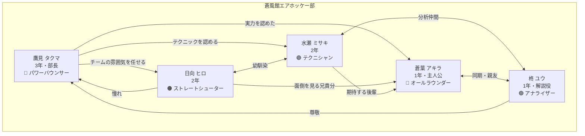
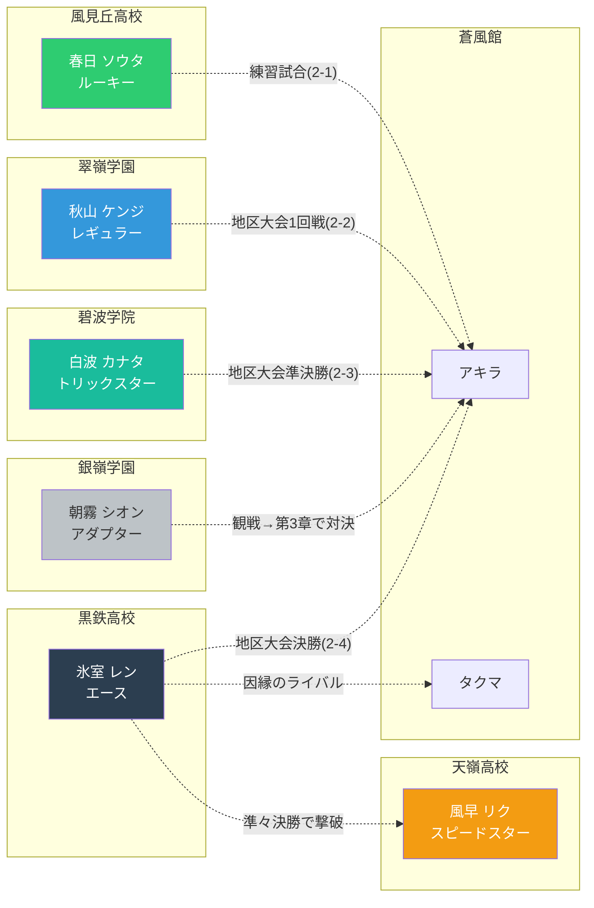
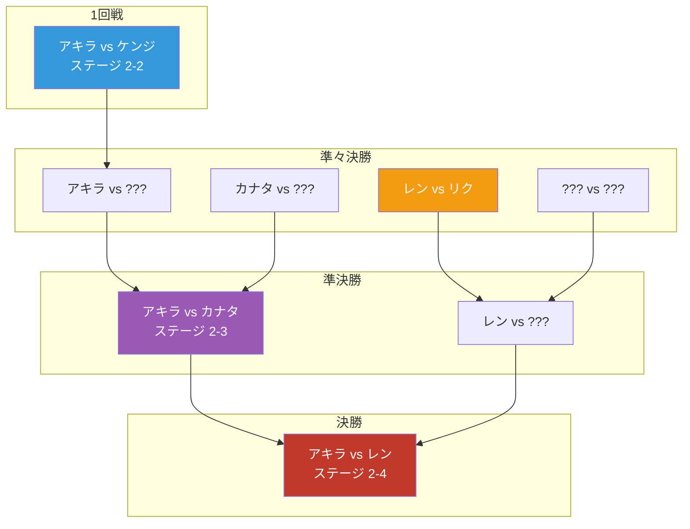
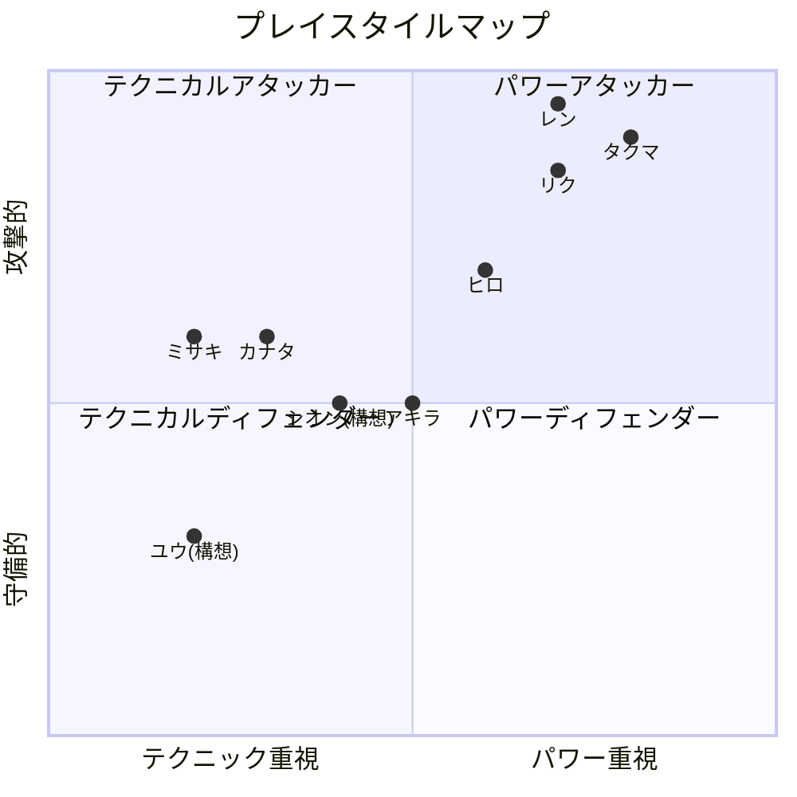

# キャラクター設定書（D-02）

> Phase 0 成果物 — 全キャラクターの詳細プロフィール
> 配置: `src/features/air-hockey/doc/world/character-profiles.md`

---

## 目次

1. [蒼風館エアホッケー部 部員（5名）](#蒼風館エアホッケー部-部員5名)
   - [蒼葉 アキラ（主人公）](#蒼葉-アキラ主人公)
   - [日向 ヒロ（ステージ 1-1）](#日向-ヒロステージ-1-1)
   - [水瀬 ミサキ（ステージ 1-2）](#水瀬-ミサキステージ-1-2)
   - [鷹見 タクマ（ステージ 1-3）](#鷹見-タクマステージ-1-3)
   - [柊 ユウ（解説役・5人目の部員）](#柊-ユウ解説役5人目の部員)
2. [フリー対戦キャラクター（3名・部外）](#フリー対戦キャラクター3名部外)
   - [春日 ソウタ（ルーキー）](#春日-ソウタルーキー)
   - [秋山 ケンジ（レギュラー）](#秋山-ケンジレギュラー)
   - [氷室 レン（エース）](#氷室-レンエース)
3. [第2章 新キャラクター（3名）](#第2章-新キャラクター3名)
   - [風早 リク（スピードスター）](#風早-リクスピードスター)
   - [白波 カナタ（トリックスター）](#白波-カナタトリックスター)
   - [朝霧 シオン（オブザーバー）](#朝霧-シオンオブザーバー)
4. [キャラクター関係図](#キャラクター関係図)
5. [プレイスタイルと AI パラメータ対応表](#プレイスタイルと-ai-パラメータ対応表)
6. [既存コードとの整合性チェック](#既存コードとの整合性チェック)

---

## 蒼風館エアホッケー部 部員（5名）

### 蒼葉 アキラ（主人公）

> _「エアホッケーって、こんなに熱くなれるんだ」_

#### 基本情報

| 項目 | 設定 |
|------|------|
| フルネーム | 蒼葉 アキラ（あおば あきら） |
| キャラ ID | `player` |
| 学年 | 1年生 |
| 年齢 | 15歳 |
| 誕生日 | 4月8日 |
| 身長 | 165cm |
| テーマカラー | 青 `#3498db` |

#### 外見

| 項目 | 設定 |
|------|------|
| 髪型・髪色 | 黒髪ショート（さっぱりした短髪） |
| 目の色 | 茶色 |
| 体格 | 普通（やや細身寄り、成長途中の体格） |
| 服装 | 白いスポーツウェア + 青いライン |
| アクセサリ | 青いリストバンド（入部時にヒロからもらった） |

#### 性格・内面

- **性格キーワード**: 素直 / 負けず嫌い / 行動派
- **詳細**: 考えるより先に体が動くタイプ。初めてのことにも臆さず飛び込む度胸がある。負けると悔しさを素直に表に出すが、引きずらず次の行動に移れる切り替えの速さが武器。人の長所を素直に認められるため、先輩たちからも可愛がられる。
- **口調**: 元気で素直な少年口調。敬語と砕けた言葉が混在する（先輩には基本敬語だが、試合中は興奮して素が出る）。
  - 得点時: 「よし！」「いける！」
  - 失点時: 「くっ…！」「まだまだ！」
  - 勝利時: 「やった！」
  - 敗北時: 「次は負けない…」
- **動機**: 入学式の帰り道、部室棟の窓からエアホッケー部の練習風景を偶然見かけた。パックが弾ける小気味よい音と、部員たちの真剣な表情に心を掴まれ、その場で入部を決意。
- **目標**: まずは部の一員として認められること。ゆくゆくは地区大会で結果を出して、チームに貢献したい。
- **弱点・コンプレックス**: 経験の浅さ。先輩たちの技術を目の当たりにすると「自分なんかが…」と一瞬弱気になることがある。しかし試合が始まれば吹き飛ぶ。

#### プレイスタイル

| 項目 | 設定 |
|------|------|
| スタイル名 | オールラウンダー（発展途上） |
| 得意技 | **ライジングショット** — 相手の意表を突く、直感的なタイミングで放つ速射 |
| 特徴 | 特定のスタイルに偏らず、対戦相手から吸収して成長する。直感的な反応速度が高い |
| 弱点（ゲーム的） | 経験不足により安定感に欠ける。長期戦になると判断ミスが増える |

#### 人間関係

| 相手 | 関係 | 詳細 |
|------|------|------|
| ヒロ | 面倒見のいい先輩 | 入部初日から世話を焼いてくれる兄貴的存在。リストバンドをもらった |
| ミサキ | 尊敬する先輩 | テクニックに感動。「頭を使う」戦い方の大切さを教わった |
| タクマ | 認めてくれた部長 | 対戦を通じて正式メンバーとして認められた。厳しいが信頼している |
| ユウ | 同期の友人 | 同じ1年生として支え合う仲。ユウの分析に助けられることが多い |

---

### 日向 ヒロ（ステージ 1-1）

> _「まずは俺と一勝負だ。基本を見せてやるよ！」_

#### 基本情報

| 項目 | 設定 |
|------|------|
| フルネーム | 日向 ヒロ（ひなた ひろ） |
| キャラ ID | `hiro` |
| 学年 | 2年生 |
| 年齢 | 16歳 |
| 誕生日 | 7月22日 |
| 身長 | 172cm |
| テーマカラー | オレンジ `#e67e22` |

#### 外見

| 項目 | 設定 |
|------|------|
| 髪型・髪色 | 茶髪の短髪（少しハネた髪型、寝癖がトレードマーク） |
| 目の色 | 緑色 |
| 体格 | 普通（バランスの取れた体型） |
| 服装 | オレンジ色のスポーツウェア |
| アクセサリ | なし（飾らない性格を反映） |

#### 性格・内面

- **性格キーワード**: 明るい / 面倒見がいい / お調子者
- **詳細**: 部のムードメーカー。誰とでもすぐに打ち解けられる社交性があり、新入部員の面倒を積極的に見る。ノリが良すぎて調子に乗ることもあるが、肝心な場面では頼りになる。自分の実力を過信しがちだが、負けた時は素直に認められる器の大きさがある。ミサキとは幼馴染で、小学生の頃からの付き合い。
- **口調**: カジュアルな男言葉。後輩にはフレンドリー、先輩（タクマ）には少し砕けた敬語。
  - 得点時: 「へへっ！」「どんなもんだ！」
  - 失点時: 「うわっ！」「マジか！」
  - 勝利時: 「俺の勝ちだな！」
  - 敗北時: 「やるじゃん！参った！」
- **動機**: 中学時代にゲームセンターでエアホッケーにハマり、高校で部活としてやれると知って即入部。純粋に「楽しいから」が一番の理由。
- **目標**: 地区大会で個人戦ベスト4に入ること。チームとしては県大会出場を目指す。
- **弱点・コンプレックス**: ミサキやタクマと比べると「自分には突出した武器がない」と感じている。ストレートショットには自信があるが、テクニックでもパワーでも上がいることを自覚しており、時折焦りを見せる。

#### プレイスタイル

| 項目 | 設定 |
|------|------|
| スタイル名 | ストレートシューター |
| 得意技 | **バレットストレート** — 最短距離で叩き込む豪快なストレートショット |
| 特徴 | 直線的で読みやすいが、その分スピードと勢いで押し切る。ストレート主体で、小細工なしの正面突破が信条 |
| 弱点（ゲーム的） | 狙いが荒く（wobble: 40px）、コントロールが安定しない。テクニカルな相手に読まれやすい |

| AI パラメータ | 値 | 対応 |
|-------------|-----|------|
| maxSpeed | 1.2 | 速度は控えめ（初戦の相手） |
| predictionFactor | 0.5 | 予測が甘い |
| wobble | 40 | 狙いが大きくブレる = ストレートだが荒い |
| skipRate | 0.1 | 時々反応が遅れる |
| centerWeight | 0.8 | 中央に寄りがち |
| wallBounce | false | 壁反射は使わない |

#### 人間関係

| 相手 | 関係 | 詳細 |
|------|------|------|
| アキラ | 後輩（弟分） | 入部初日から世話を焼く。アキラの成長を一番近くで見守る |
| ミサキ | 幼馴染 | 小学校からの付き合い。互いに遠慮なく言い合える関係。ミサキのことは「ミサキ」と呼び捨て |
| タクマ | 憧れの先輩 | タクマの圧倒的な強さに憧れて入部を決意した一面もある。「あの人みたいになりたい」 |
| ユウ | 後輩 | ユウの分析を「すげー」と素直に感心するが、データより直感を信じるタイプ |

---

### 水瀬 ミサキ（ステージ 1-2）

> _「テクニックがないと厳しいかも♪」_

#### 基本情報

| 項目 | 設定 |
|------|------|
| フルネーム | 水瀬 ミサキ（みなせ みさき） |
| キャラ ID | `misaki` |
| 学年 | 2年生 |
| 年齢 | 16歳 |
| 誕生日 | 11月15日 |
| 身長 | 162cm |
| テーマカラー | 紫 `#9b59b6` |

#### 外見

| 項目 | 設定 |
|------|------|
| 髪型・髪色 | 紫がかった黒髪のポニーテール |
| 目の色 | 紫色 |
| 体格 | 細身（しなやかな体型） |
| 服装 | 紫のスポーツウェア |
| アクセサリ | 紫のヘアゴム（ポニーテールをまとめている） |

#### 性格・内面

- **性格キーワード**: 知的 / 負けず嫌い（隠している） / 世話焼き
- **詳細**: 一見クールで余裕がある振る舞いだが、内面は相当な負けず嫌い。試合中は冷静に見えるが、本当は勝利への執念が強い。後輩の面倒見が良く、アドバイスは的確。ヒロとは幼馴染で、ヒロの無鉄砲さに呆れつつも信頼している。分析的な思考が得意で、相手の癖を見抜くのが早い。
- **口調**: やや大人びた女性口調。余裕のある話し方だが、本気の時は語気が鋭くなる。
  - 得点時: 「ふふっ♪」「こんなもんよ」
  - 失点時: 「え、嘘…」「やるわね…」
  - 勝利時: 「私の勝ちね♪」
  - 敗北時: 「あなた…やるわね」
- **動機**: ヒロに誘われて入部。最初は付き合い程度だったが、エアホッケーの「読み合い」の奥深さに魅了された。チェスのような頭脳戦の要素に惹かれている。
- **目標**: テクニックで誰にも負けないプレイヤーになること。パワーで劣る分、知恵と技術で上回りたい。
- **弱点・コンプレックス**: パワー不足。どれだけ正確に打っても、タクマのようなパワーショットには対応しきれないことがある。「力で押し切られる」展開に弱い。

#### プレイスタイル

| 項目 | 設定 |
|------|------|
| スタイル名 | テクニシャン |
| 得意技 | **ファントムカーブ** — 微妙な角度調整で相手の予測を外す変化球ショット |
| 特徴 | パック軌道の高精度な予測と、アイテムの戦略的活用が持ち味。相手の癖を分析し、弱点を突く頭脳派 |
| 弱点（ゲーム的） | パワーが弱く、力押しに弱い。ストレートのスピード勝負では分が悪い |

| AI パラメータ | 値 | 対応 |
|-------------|-----|------|
| maxSpeed | 3.0 | 中程度の速度 |
| predictionFactor | 4 | 高い予測精度 = テクニカルな読み |
| wobble | 10 | ブレが少ない = 正確なコントロール |
| skipRate | 0.02 | ほぼミスしない |
| centerWeight | 0.2 | ポジショニングが柔軟 |
| wallBounce | false | 壁反射は使わない（角度計算はするが力で跳ね返す技術はない） |

- **アイテム出現間隔**: 4000ms（通常より速い = アイテム戦が得意な演出）
- **逆転補正閾値**: 2点差（通常3点差より早く逆転補正が入る）

#### 人間関係

| 相手 | 関係 | 詳細 |
|------|------|------|
| アキラ | 後輩（期待） | アキラの直感的なプレイに可能性を感じている。「教えがいがある」と評価 |
| ヒロ | 幼馴染 | 小学校からの腐れ縁。ヒロの大雑把さに「もう…」と呆れつつ、実は信頼している |
| タクマ | 尊敬する先輩 | タクマの圧倒的な実力を認めており、「いつか超える」と密かに思っている |
| ユウ | 分析仲間 | ユウのデータ分析を高く評価。二人で対戦相手の研究をすることも |

---

### 鷹見 タクマ（ステージ 1-3）

> _「面白い。だが部長の俺を倒すのは、そう簡単じゃないぞ。」_

#### 基本情報

| 項目 | 設定 |
|------|------|
| フルネーム | 鷹見 タクマ（たかみ たくま） |
| キャラ ID | `takuma` |
| 学年 | 3年生 |
| 年齢 | 17歳 |
| 誕生日 | 2月3日 |
| 身長 | 180cm |
| テーマカラー | 赤 `#c0392b` |

#### 外見

| 項目 | 設定 |
|------|------|
| 髪型・髪色 | 黒髪の短いオールバック |
| 目の色 | 鋭い赤茶色 |
| 体格 | がっしり（部内で最も体格が良い） |
| 服装 | 赤いスポーツウェア |
| アクセサリ | 赤いヘッドバンド（試合時に着用） |

#### 性格・内面

- **性格キーワード**: 威厳 / 責任感 / 不器用な優しさ
- **詳細**: 寡黙で厳しい印象を与えるが、部の仲間を誰よりも大切に思っている。部長としての責任感が強く、「自分がチームを引っ張らなければ」というプレッシャーを常に感じている。言葉で伝えるのが苦手で、態度や行動で示すタイプ。アキラを正式メンバーとして認めた場面に見られるように、実力を認めた相手には素直に敬意を示す。
- **口調**: 硬派で簡潔な男言葉。余計なことは言わない。認めた時だけ言葉数が増える。
  - 得点時: 「甘いな」「まだまだだ」
  - 失点時: 「…なかなかやる」「ほう…」
  - 勝利時: 「部長の座は渡さんぞ」
  - 敗北時: 「見事だ…お前を認める」
- **動機**: 蒼風館エアホッケー部の創部メンバー（1年生の時に入部）。当時はまだ部員3名で、先輩もいない中で部を一から育ててきた。自分たちが作った部を「強豪」にすることが使命。
- **目標**: 引退前に県大会でチームをベスト8以上に導くこと。そして後輩たちに「全国」を目指せるチームを残すこと。
- **弱点・コンプレックス**: パワーに頼りすぎる傾向。繊細なコントロールが必要な場面では、ミサキのようなテクニシャンに劣ることを自覚している。また、3年生として「引退」が近づく焦りを内に秘めている。

#### プレイスタイル

| 項目 | 設定 |
|------|------|
| スタイル名 | パワーバウンサー |
| 得意技 | **サンダーウォール** — 壁反射を利用した予測困難なパワーショット |
| 特徴 | 圧倒的なパワーと壁反射の読みを組み合わせた、力と技の融合スタイル。直線でもバウンスでも高速で正確 |
| 弱点（ゲーム的） | スピード特化のため、意表を突く変化球には対応が遅れることがある |

| AI パラメータ | 値 | 対応 |
|-------------|-----|------|
| maxSpeed | 5.0 | 非常に速い |
| predictionFactor | 10 | 極めて高い予測精度 |
| wobble | 0 | ブレなし = 完璧な精度 |
| skipRate | 0 | ミスなし |
| centerWeight | 0 | ポジショニングが完全に自由 |
| wallBounce | true | 壁反射を予測・活用する |

- **逆転補正閾値**: 2点差
- **逆転補正マレットボーナス**: 0.15
- **逆転補正ゴール縮小**: 0.15

#### 人間関係

| 相手 | 関係 | 詳細 |
|------|------|------|
| アキラ | 認めた後輩 | 対戦を通じて才能を認め、正式メンバーに迎えた。期待しているが、あえて厳しく接する |
| ヒロ | 頼れる後輩 | ヒロのムードメーカーとしての力を評価。チームの雰囲気づくりを任せている |
| ミサキ | 実力を認める仲間 | テクニック面では自分を上回ると認めている。ペア戦のパートナー候補 |
| ユウ | データ参謀 | ユウの分析力を重宝。大会戦略を一緒に練ることも |

---

### 柊 ユウ（解説役・5人目の部員）

> _「データは嘘をつかない。でも、試合は数字だけじゃ決まらないんだよね」_

#### 基本情報

| 項目 | 設定 |
|------|------|
| フルネーム | 柊 ユウ（ひいらぎ ゆう） |
| キャラ ID | `yuu`（将来実装時） |
| 学年 | 1年生 |
| 年齢 | 15歳 |
| 誕生日 | 9月12日 |
| 身長 | 160cm |
| テーマカラー | 緑 `#2ecc71` |

#### 外見

| 項目 | 設定 |
|------|------|
| 髪型・髪色 | 黒髪のやや長めのマッシュヘア（目にかかるくらい） |
| 目の色 | 深い緑色 |
| 体格 | 細身（インドア派の体格） |
| 服装 | 緑のスポーツウェア（ただし普段はジャージの上にパーカーを羽織っている） |
| アクセサリ | 丸メガネ、首からストップウォッチを下げている |

#### 性格・内面

- **性格キーワード**: 分析的 / 控えめ / 芯が強い
- **詳細**: 物事を観察・分析するのが好きで、部の「頭脳」としてデータ面からチームを支える。一見おとなしそうだが、自分の分析結果には自信を持っており、間違っていると思ったことには先輩相手でもはっきり意見する芯の強さがある。アキラとは入学式で偶然隣の席になり、そのまま一緒にエアホッケー部に入部した。
- **口調**: 穏やかで丁寧。データや数字を引用して話すことが多い。興奮すると早口になる。
  - 解説時: 「このパターンだと、右サイドに来る確率が高いです」
  - 応援時: 「アキラ、相手の癖が見えてきました！」
  - 驚き時: 「これは…データにないパターンだ…！」
- **動機**: スポーツは苦手だが、スポーツの「データ分析」に興味があった。エアホッケーの試合データを記録・分析する中で、部に居場所を見つけた。
- **目標**: チームの参謀として、分析面から大会に貢献すること。いつかは自分も選手としてコートに立ちたいという密かな野望も。
- **弱点・コンプレックス**: 運動が苦手で反射神経に自信がない。「自分は裏方だから」と自分を役割に閉じ込めがち。

#### プレイスタイル（将来の隠しモード構想）

| 項目 | 設定 |
|------|------|
| スタイル名 | アナライザー |
| 得意技 | **データドライブ** — 相手の癖をデータから読み切り、最適解のコースに打つ精密ショット |
| 特徴 | 予測精度は高いがスピードは遅い。長期戦で相手のパターンを学習し、後半に強くなる「学習型」AI |
| 弱点（ゲーム的） | 序盤は弱く、パワーショットに対応しきれない |

> **隠しモード構想メモ**: 全ステージクリア後に解放される隠し対戦キャラ。序盤は弱いが、ラウンドが進むにつれて AI のパラメータが段階的に上昇する「成長型」AI として実装予定。プレイヤーにとって「早めに決着をつけるか、持久戦に付き合うか」の戦略的判断を迫る、ユニークな対戦体験を目指す。

#### 人間関係

| 相手 | 関係 | 詳細 |
|------|------|------|
| アキラ | 同期・親友 | 入学式で出会い、一緒に入部。アキラの直感とユウの分析で補完し合う |
| ヒロ | 明るい先輩 | ヒロの豪快さに振り回されつつも楽しんでいる |
| ミサキ | 分析仲間 | 分析アプローチが似ており、一緒にデータを見ることが多い |
| タクマ | 尊敬する部長 | タクマの「チームのために」という姿勢に強く共感 |

---

## フリー対戦キャラクター（3名・部外）

> フリー対戦モードで選択可能な対戦相手。蒼風館以外のキャラクターで、将来的に隠しモードとしてストーリーに組み込む構想あり。

### 春日 ソウタ（ルーキー）

> _「おっ、入った！ ラッキー！」_

#### 基本情報

| 項目 | 設定 |
|------|------|
| フルネーム | 春日 ソウタ（かすが そうた） |
| キャラ ID | `rookie` |
| 所属 | 風見丘高校エアホッケー同好会（地区内の近隣校） |
| 学年 | 1年生 |
| テーマカラー | ライム `#27ae60` |
| 難易度 | Easy |

#### 外見

| 項目 | 設定 |
|------|------|
| 髪型・髪色 | 金髪のぼさぼさ髪 |
| 目の色 | 青い目 |
| 服装 | 緑のスポーツウェア |

#### 性格

- **性格キーワード**: のんびり / 楽天的
- **口調**: おっとりした口調。勝敗にこだわらず、楽しむことが最優先。
  - 得点時: 「おっ、入った！」「ラッキー！」
  - 失点時: 「あちゃー」「やるね〜」
  - 勝利時: 「やったー！」
  - 敗北時: 「ま、いっか〜」

> **隠しモード構想メモ**: 練習試合や交流戦で蒼風館と対戦するシナリオ。エアホッケー初心者だが、「楽しんでるうちに強くなってた」タイプ。再登場時には成長した姿を見せる展開。

---

### 秋山 ケンジ（レギュラー）

> _「いい感じ！ もらった！」_

#### 基本情報

| 項目 | 設定 |
|------|------|
| フルネーム | 秋山 ケンジ（あきやま けんじ） |
| キャラ ID | `regular` |
| 所属 | 翠嶺学園エアホッケー部（地区の中堅校） |
| 学年 | 2年生 |
| テーマカラー | ネイビー `#2c3e50` |
| 難易度 | Normal |

#### 外見

| 項目 | 設定 |
|------|------|
| 髪型・髪色 | 茶髪のスポーツ刈り |
| 目の色 | 茶色い目 |
| 服装 | 青のスポーツウェア |

#### 性格

- **性格キーワード**: 真面目 / 努力家
- **口調**: 落ち着いているが、闘志は秘めている。相手を認める度量がある。
  - 得点時: 「いい感じ！」「もらった！」
  - 失点時: 「なかなかやるな」「ちっ…」
  - 勝利時: 「勝った！」
  - 敗北時: 「やるじゃないか…」

> **隠しモード構想メモ**: 地区大会で蒼風館と対戦する可能性あり。堅実なプレイスタイルで「基本に忠実」な強さを持つ。第2章で再登場の候補。

---

### 氷室 レン（エース）

> _「…面白い」_

#### 基本情報

| 項目 | 設定 |
|------|------|
| フルネーム | 氷室 レン（ひむろ れん） |
| キャラ ID | `ace` |
| 所属 | 黒鉄高校エアホッケー部（地区の強豪校） |
| 学年 | 3年生 |
| テーマカラー | 黒+赤 `#2c3e50` / `#e74c3c` |
| 難易度 | Hard |

#### 外見

| 項目 | 設定 |
|------|------|
| 髪型・髪色 | 銀髪のウルフカット |
| 目の色 | 灰色の目 |
| 服装 | 黒のスポーツウェア + 赤いライン |

#### 性格

- **性格キーワード**: クール / 実力主義
- **口調**: 必要最低限の言葉しか発さない。実力を認めた相手にだけ敬意を示す。
  - 得点時: 「当然だ」「フッ…」
  - 失点時: 「…面白い」「なるほどな」
  - 勝利時: 「実力通りだ」
  - 敗北時: 「…認めよう、お前は強い」

> **第2章での役割**: 地区大会決勝（ステージ 2-4）のボス。タクマとの因縁を引き継ぎ、アキラと激突する。詳細は `chapter2-plot.md` を参照。

---

## 第2章 新キャラクター（3名）

> 第2章（地区大会編）で新たに登場するキャラクター。すべて架空の学校に所属し、実在する学校とは無関係です。

### 風早 リク（スピードスター）

> _「速さこそ正義！ ——のはずだったんだけどな…」_

#### 基本情報

| 項目 | 設定 |
|------|------|
| フルネーム | 風早 リク（かざはや りく） |
| キャラ ID | `riku`（将来実装時） |
| 所属 | 天嶺高校エアホッケー部（地区の中堅〜強豪校） |
| 学年 | 2年生 |
| 年齢 | 16歳 |
| 誕生日 | 5月5日 |
| 身長 | 175cm |
| テーマカラー | 黄 `#f39c12` |

#### 外見

| 項目 | 設定 |
|------|------|
| 髪型・髪色 | 明るい茶髪のツンツンヘア（ワックスで立てている） |
| 目の色 | 琥珀色 |
| 体格 | 細身で筋肉質（短距離走の選手のような体型） |
| 服装 | 黄色いスポーツウェア + 白いライン |
| アクセサリ | 黄色いスポーツバンダナ（額に巻いている） |

#### 性格・内面

- **性格キーワード**: 自信家 / 負けず嫌い / 素直
- **詳細**: スピードに絶対の自信を持つスプリンタータイプ。「速ければ勝てる」を信条とし、練習では反射神経と初動の速さを徹底的に鍛えてきた。自信家だが嫌味がなく、負けた相手にも素直にリスペクトを送れる好青年。レンに完敗した後、「速さだけじゃダメなんだ」と自分の限界に気づく。
- **口調**: 元気で前向きな男口調。テンションが高い。
  - 得点時: 「速い！ 俺の勝ち！」「へへ、見えなかっただろ？」
  - 失点時: 「うそ、今の返された!?」「マジか…」
  - 勝利時: 「スピードこそパワー！」
  - 敗北時: 「…完敗だ。お前、マジで速いな」
- **動機**: 陸上部から転部。「反射神経を活かせるスポーツ」としてエアホッケーを始めた。
- **目標**: 地区大会で「最速プレイヤー」の称号を得ること。
- **弱点・コンプレックス**: スピード以外の引き出しが少ない。読み合いや変則プレイに弱く、同じ速さ以上の相手にはなすすべがない。

#### プレイスタイル

| 項目 | 設定 |
|------|------|
| スタイル名 | スピードスター |
| 得意技 | **ソニックラッシュ** — 超速の連続ショットで相手に反応する暇を与えない速射連撃 |
| 特徴 | 初動の速さと反射神経が武器。パックに最速で追いつき、速射で相手を圧倒する |
| 弱点（ゲーム的） | 変則軌道や壁反射に弱い。読み合いより反射に頼るため、フェイントに引っかかりやすい |

| AI パラメータ | 値 | 対応 |
|-------------|-----|------|
| maxSpeed | 5.5 | 非常に速い（レンに次ぐスピード） |
| predictionFactor | 3 | 予測はそこそこ（反射頼り） |
| wobble | 15 | やや荒い（速さ優先の精度） |
| skipRate | 0 | ミスなし（反射神経は確か） |
| centerWeight | 0.3 | 攻撃的なポジショニング |
| wallBounce | false | 壁反射は使わない（直線主義） |

#### 人間関係

| 相手 | 関係 | 詳細 |
|------|------|------|
| レン | 完敗した相手 | 準々決勝で敗北。「あいつの速さはレベルが違う」と認めている |
| アキラ | 大会で出会った同世代 | 決勝前に忠告をくれる。アキラの「速さ以外の武器」に興味を持つ |

#### 第2章での役割

- **登場形態**: ストーリー上の言及 + 準決勝以降の観客席
- **物語上の機能**: レンの強さの引き立て役。「速さに絶対の自信を持つリクでさえ完敗した」ことで、レンの脅威を間接的に伝える
- **決勝前の場面**: アキラに「あいつ（レン）のスピード、マジでヤバい。でもお前なら…何か持ってる気がする。頑張れ」と声をかける

---

### 白波 カナタ（トリックスター）

> _「ねぇ、エアホッケーってさ——予想通りにいかないから面白いんだよね？」_

#### 基本情報

| 項目 | 設定 |
|------|------|
| フルネーム | 白波 カナタ（しらなみ かなた） |
| キャラ ID | `kanata`（将来実装時） |
| 所属 | 碧波学院エアホッケー部（地区内の進学校） |
| 学年 | 2年生 |
| 年齢 | 16歳 |
| 誕生日 | 3月14日 |
| 身長 | 168cm |
| テーマカラー | ティール `#1abc9c` |

#### 外見

| 項目 | 設定 |
|------|------|
| 髪型・髪色 | 水色がかった黒髪のミディアムヘア（片目にかかるサイドバング） |
| 目の色 | 薄い水色 |
| 体格 | 中肉中背（目立たない体型） |
| 服装 | 白いスポーツウェア + ティール色のライン |
| アクセサリ | 左手首にミサンガ（碧波学院の部員で揃いのもの） |

#### 性格・内面

- **性格キーワード**: 飄々 / 享楽家 / 観察眼
- **詳細**: 一見すると真剣味が薄いように見えるが、実は非常に頭が回る。相手の表情や動きを観察し、「予測を外す」ことに快感を覚えるタイプ。勝ち負けよりも「面白い試合」を追求しており、相手が翻弄されて慌てる姿を見るのが好き。しかし根は優しく、試合後は相手を素直に褒める。飄々とした態度の裏に、「予測できないことこそ人生の醍醐味」という価値観がある。
- **口調**: 柔らかく掴みどころのない口調。敬語でも砕けた言葉でもない独特の距離感。
  - 得点時: 「あはは、引っかかった♪」「ね、読めなかったでしょ？」
  - 失点時: 「お、見抜かれた。やるじゃん」「へぇ…面白いね」
  - 勝利時: 「楽しかったよ。またやろ？」
  - 敗北時: 「あはは、読まれちゃったか。キミ、面白いね」
- **動機**: ボードゲームやパズルが趣味で、「読み合い」のあるスポーツを探していた。エアホッケーの「角度と反射の計算」に惹かれて入部。
- **目標**: 「誰も予測できない一打」を打つこと。大会の順位より、自分のプレイの完成度に興味がある。
- **弱点・コンプレックス**: 勝ちへの執着が薄いため、追い込まれた時のギアチェンジが遅い。また、まっすぐな相手（アキラのようなタイプ）の予測を外せない場面がある。

#### プレイスタイル

| 項目 | 設定 |
|------|------|
| スタイル名 | トリックスター |
| 得意技 | **ミラージュバウンド** — 壁反射を複数回利用し、パックの着地点を予測不能にする幻惑ショット |
| 特徴 | 壁反射と変則軌道を駆使し、相手の予測を意図的に外す。アイテムも戦略的に使い、カオスな展開に持ち込む |
| 弱点（ゲーム的） | パワーとスピードは平均的。直線的なパワーショットを正面から打ち合うと不利 |

| AI パラメータ | 値 | 対応 |
|-------------|-----|------|
| maxSpeed | 3.8 | やや速い程度 |
| predictionFactor | 5 | 中程度の予測（自分が予測を外す側） |
| wobble | 20 | **意図的なブレ** = トリッキーな軌道を生む |
| skipRate | 0 | ミスなし |
| centerWeight | 0.1 | 予測不能なポジショニング |
| wallBounce | true | 壁反射を多用（トリックの根幹） |

- **アイテム出現間隔**: 3500ms（アイテムが多め = カオスな展開を演出）
- **逆転補正閾値**: 2点差（初見殺しへの救済）

#### 人間関係

| 相手 | 関係 | 詳細 |
|------|------|------|
| アキラ | 準決勝の対戦相手 | アキラの「まっすぐさ」に興味を持つ。トリックが通じない相手として認める |
| レン | 大会で面識あり | 「あの人は強いけど、面白くない。予想通りに強いだけ」と評す |
| ミサキ | 似たタイプ | 読み合いを好む点で共通。「あの子とはいい勝負ができそう」 |

#### 第2章での役割

- **登場形態**: ステージ 2-3（準決勝）のプレイアブル対戦相手
- **物語上の機能**: 「まっすぐなだけでは勝てない」壁。アキラが相手の癖を観察し適応する力＝「自分のスタイル」の萌芽を描くための存在
- **試合の展開**: 前半はカナタの変則プレイに翻弄されるが、ユウの分析とタクマの一言を経て後半から対応し始める

---

### 朝霧 シオン（オブザーバー）

> _「ふぅん…面白い選手がいるじゃない」_

#### 基本情報

| 項目 | 設定 |
|------|------|
| フルネーム | 朝霧 シオン（あさぎり しおん） |
| キャラ ID | `shion`（将来実装時） |
| 所属 | 銀嶺学園エアホッケー部（県内の強豪校） |
| 学年 | 2年生 |
| 年齢 | 16歳 |
| 誕生日 | 1月7日 |
| 身長 | 170cm |
| テーマカラー | 白銀 `#bdc3c7` |

#### 外見

| 項目 | 設定 |
|------|------|
| 髪型・髪色 | 銀灰色のセミロング（後ろで一つにまとめている） |
| 目の色 | 淡いグレー |
| 体格 | すらりとした長身（しなやかで無駄のない体つき） |
| 服装 | 白いスポーツウェア + 銀色のライン（観戦時は銀嶺学園のジャージ） |
| アクセサリ | 左耳に小さなシルバーのピアス |

#### 性格・内面

- **性格キーワード**: 冷静 / 分析的 / 好奇心旺盛
- **詳細**: 一見冷淡に見えるが、実は「面白い選手」を見つけることに強い情熱を持つ。試合を観察して相手のプレイスタイル・癖・メンタルの動きまで分析する天才肌。地区大会にはスカウティング目的で来ており、自身は県大会からの出場。アキラの「経験が浅いのに適応力がある」点に強い興味を示す。ユウとは分析者同士として波長が合いそうな予感。
- **口調**: 落ち着いた、やや中性的な口調。興味のある相手には饒舌になる。
  - 観察時: 「なるほど…あの角度から適応するのか」
  - 興味時: 「ふぅん…面白い選手がいるじゃない」
  - 挑発時: 「県大会で会えるといいね。——その時は、手加減しないから」
- **動機**: 幼い頃からあらゆるスポーツの試合を観戦するのが趣味。エアホッケーの「1対1の駆け引き」に魅了され、自ら選手として始めた。
- **目標**: 全国大会制覇。そのために「自分を倒せる可能性のある選手」を常に探している。
- **弱点・コンプレックス**: 分析に時間をかけすぎる傾向。初見の相手に対して序盤は様子を見るため、開始直後に一気に攻められると出遅れることがある。また、「予測不能な直感型プレイヤー」に対しては分析が追いつかない可能性がある。

#### プレイスタイル（第3章以降で実装予定）

| 項目 | 設定 |
|------|------|
| スタイル名 | アダプター（万能適応型） |
| 得意技 | **ゼロリーディング** — 相手の癖を試合中にリアルタイムで解析し、最適な返球コースを導く読み切りショット |
| 特徴 | 序盤は相手を観察して控えめに戦い、中盤以降に「相手の攻略法」を見つけて一気に畳みかける。いわば「対人特化の学習型AI」 |
| 弱点（ゲーム的） | 序盤はスロースタート。開幕ラッシュで差をつけられると取り返すのが厳しい |

| AI パラメータ（構想） | 序盤 | 中盤 | 終盤 | 対応 |
|---------------------|------|------|------|------|
| maxSpeed | 3.0 | 4.5 | 6.0 | 段階的に速度上昇 |
| predictionFactor | 4 | 8 | 14 | 分析が進むにつれ予測精度が向上 |
| wobble | 10 | 5 | 0 | 精度が段階的に上昇 |
| skipRate | 0.05 | 0.01 | 0 | ミスが減少 |
| centerWeight | 0.3 | 0.1 | 0 | ポジショニングが最適化 |
| wallBounce | false | true | true | 中盤以降壁反射を活用 |

> **実装構想メモ**: ユウの「学習型AI」と似たコンセプトだが、シオンは「対戦相手の癖に適応する」タイプ。ユウが「汎用的に成長する」のに対し、シオンは「特定の相手に最適化される」点が異なる。プレイヤーにとっては「いつもの攻め方が通じなくなる」恐怖を体験させるデザイン。

#### 人間関係

| 相手 | 関係 | 詳細 |
|------|------|------|
| アキラ | 観察対象→ライバル | 「経験が浅いのに適応力がある」点に強い興味。第3章で対決 |
| レン | 認識している | 「地区レベルでは強い。でも県では…」と冷静に評価 |
| ユウ | 未接触（将来） | 分析者同士。第3章で出会い、情報戦を展開する可能性 |

#### 第2章での役割

- **登場形態**: 決勝戦の観客席から一言のみ
- **物語上の機能**: 第3章（県大会編）の伏線。「この先にはもっと強い相手がいる」ことを暗示
- **登場場面**:
  - 勝利ルート: 「ふぅん…蒼風館、か。面白い選手がいるじゃない」
  - 敗北ルート: 「惜しかったね。でも——あの1年、面白い目をしてた」

---

## キャラクター関係図

### 蒼風館エアホッケー部 内部関係

### 他校キャラクターとの関係

### 地区大会トーナメント構造

### 感情の流れ（主人公アキラ視点・第1章〜第2章）

```mermaid
flowchart LR
    A["入部前<br/>興味・期待"] --> B["vsヒロ<br/>楽しさの発見"]
    B --> C["vsミサキ<br/>技術の奥深さ"]
    C --> D["vsタクマ<br/>本気の壁"]
    D --> E["正式メンバー<br/>仲間意識"]
    E --> F["vsソウタ<br/>大会前の安心"]
    F --> G["vsケンジ<br/>初の公式戦"]
    G --> H["vsカナタ<br/>翻弄→覚醒"]
    H --> I["vsレン<br/>全力の激闘"]
    I --> J["結末<br/>達成 or 決意"]

    style A fill:#f0f0f0,color:#333
    style B fill:#e67e22,color:#fff
    style C fill:#9b59b6,color:#fff
    style D fill:#c0392b,color:#fff
    style E fill:#3498db,color:#fff
    style F fill:#2ecc71,color:#fff
    style G fill:#3498db,color:#fff
    style H fill:#1abc9c,color:#fff
    style I fill:#c0392b,color:#fff
    style J fill:#f1c40f,color:#333
```

---

## プレイスタイルと AI パラメータ対応表

各キャラクターのプレイスタイルが、ゲーム内の AI 動作とどう対応しているかの一覧です。

| キャラ | スタイル名 | 得意技 | 攻撃力 | 技術力 | 速度 | 安定性 |
|--------|-----------|--------|--------|--------|------|--------|
| アキラ | オールラウンダー | ライジングショット | ★★★ | ★★★ | ★★★ | ★★ |
| ヒロ | ストレートシューター | バレットストレート | ★★★ | ★★ | ★★ | ★★ |
| ミサキ | テクニシャン | ファントムカーブ | ★★ | ★★★★★ | ★★★ | ★★★★ |
| タクマ | パワーバウンサー | サンダーウォール | ★★★★★ | ★★★★ | ★★★★★ | ★★★★★ |
| ユウ | アナライザー | データドライブ | ★★ | ★★★★ | ★★ | ★★★★★（後半） |
| リク | スピードスター | ソニックラッシュ | ★★★★ | ★★ | ★★★★★ | ★★★ |
| カナタ | トリックスター | ミラージュバウンド | ★★★ | ★★★★ | ★★★ | ★★★ |
| シオン | アダプター | ゼロリーディング | ★★★（→★★★★★） | ★★★★★ | ★★★（→★★★★★） | ★★★★★ |

### AI パラメータ詳細対応

#### 第1章ステージ

| パラメータ | ヒロ (1-1) | ミサキ (1-2) | タクマ (1-3) | 世界観上の意味 |
|-----------|-----------|-------------|-------------|--------------|
| maxSpeed | 1.2 | 3.0 | 5.0 | マレット移動の速さ。体格・反射神経を反映 |
| predictionFactor | 0.5 | 4 | 10 | パック軌道の予測精度。経験・分析力を反映 |
| wobble | 40 | 10 | 0 | 狙いのブレ。コントロール精度を反映 |
| skipRate | 0.1 | 0.02 | 0 | 反応の遅れ。集中力・安定感を反映 |
| centerWeight | 0.8 | 0.2 | 0 | 中央に寄る傾向。ポジショニングの柔軟性を反映 |
| wallBounce | false | false | true | 壁反射の活用。高度な技術・パワーの証 |

#### 第2章ステージ

| パラメータ | ソウタ (2-1) | ケンジ (2-2) | カナタ (2-3) | レン (2-4) | 世界観上の意味 |
|-----------|-------------|-------------|-------------|-----------|--------------|
| maxSpeed | 1.5 | 3.5 | 3.8 | 6.0 | 速度の段階的上昇 |
| predictionFactor | 1 | 6 | 5 | 12 | ケンジの堅実さ vs カナタの変則性 |
| wobble | 30 | 5 | 20 | 0 | カナタは意図的なブレ（トリック） |
| skipRate | 0.05 | 0.01 | 0 | 0 | ケンジの「ミスしない」堅実さ |
| centerWeight | 0.7 | 0.4 | 0.1 | 0 | カナタの予測不能なポジション |
| wallBounce | false | false | true | true | カナタとレンが壁反射を活用 |

---

## 既存コードとの整合性チェック

### チェック結果

| 項目 | ソース | 確認事項 | 結果 |
|------|--------|---------|------|
| キャラ ID | `characters.ts` | player, hiro, misaki, takuma, rookie, regular, ace | ✅ 一致 |
| テーマカラー | `characters.ts` | アキラ=#3498db, ヒロ=#e67e22, ミサキ=#9b59b6, タクマ=#c0392b | ✅ 一致 |
| リアクション | `characters.ts` | 全キャラの得点・失点・勝利・敗北リアクションが口調設定と整合 | ✅ 一致 |
| ダイアログ | `dialogue-data.ts` | ヒロ「新入り」「俺」、ミサキ「〜わよ」「〜ね♪」、タクマ「〜ぞ」「来い」 | ✅ 一致 |
| 外見 | `image-prompts.md` | 髪色・目色・服装がアイコンプロンプトと整合 | ✅ 一致 |
| AI 設定 | `story-balance.ts` | プレイスタイルと AI パラメータの対応が論理的に整合 | ✅ 一致 |

### 既存データとの不整合箇所

**なし** — 本設定書は既存コードの設定を「拡張」するのみで、変更は行っていません。

### 注意事項

- フリー対戦3名のテーマカラーは本設定書で個別カラー（ソウタ=#27ae60, ケンジ=#2c3e50, レン=#2c3e50/#e74c3c）を正式採用した。現在のコード（`characters.ts`）では全員 `#e74c3c` のままであり、Phase 1 以降で更新予定
- 柊ユウ（5人目）は現在コード上に存在しないため、Phase 1 以降で `characters.ts` に追加予定
- 第2章の新キャラ3名（リク・カナタ・シオン）も現在コード上に存在しないため、第2章実装時に `characters.ts` に追加予定
- すべての学校名（蒼風館高等学校、風見丘高校、翠嶺学園、黒鉄高校、天嶺高校、碧波学院、銀嶺学園）は架空の学校名であり、実在する学校とは無関係
- キャラクター名もすべてオリジナルであり、実在の人物とは無関係
