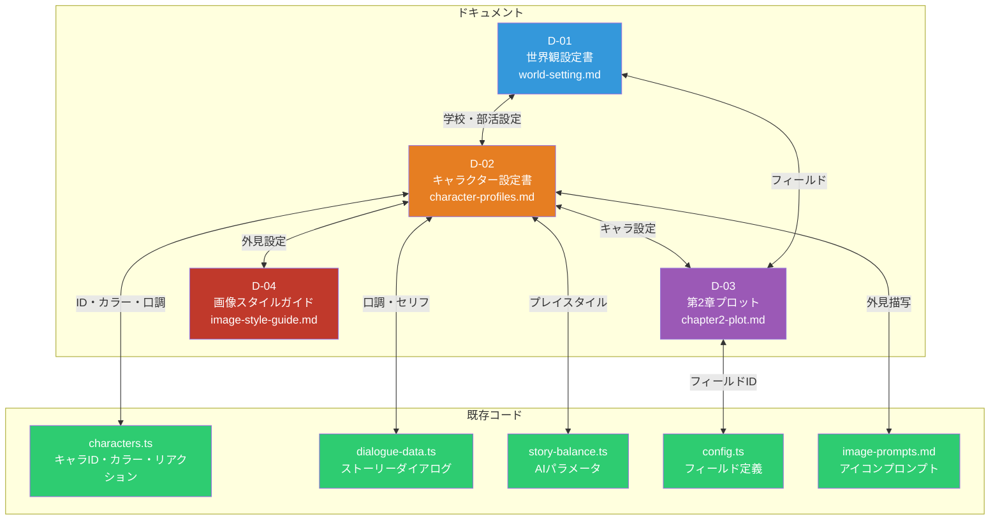
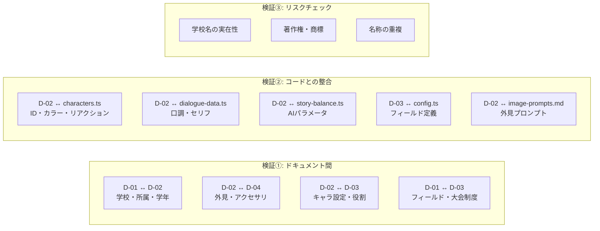
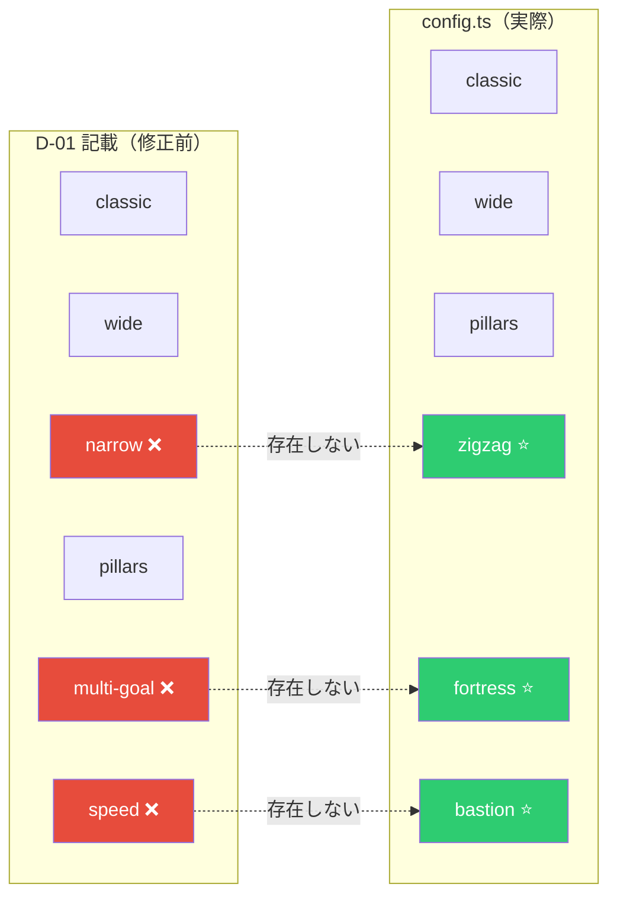
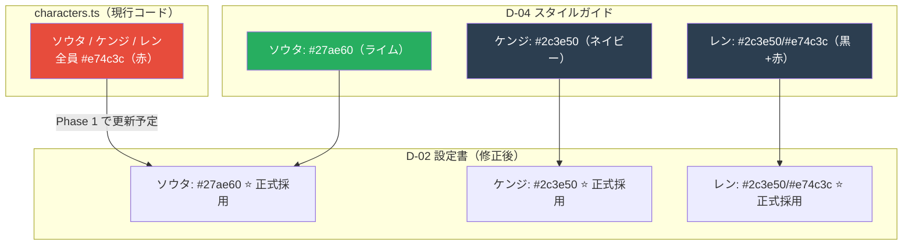
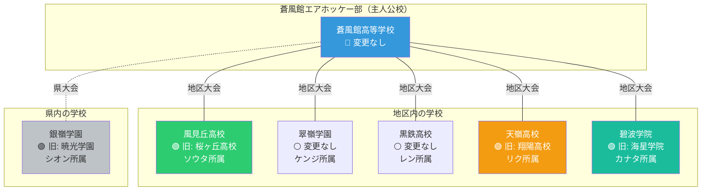

# 整合性レビューレポート（P0-05）

> Phase 0 成果物 — D-01〜D-04 のドキュメント間整合性および既存コードとの整合性検証結果
> 実施日: 2026-03-11

---

## 目次

1. [レビュー概要](#レビュー概要)
2. [検証範囲](#検証範囲)
3. [発見した不整合と対応](#発見した不整合と対応)
4. [ドキュメント間の整合性検証](#ドキュメント間の整合性検証)
5. [既存コードとの整合性検証](#既存コードとの整合性検証)
6. [学校名の実在性チェック](#学校名の実在性チェック)
7. [法律・著作権リスクチェック](#法律著作権リスクチェック)
8. [最終ステータス](#最終ステータス)

---

## レビュー概要

### レビュー対象

### 結果サマリ

| カテゴリ | 発見数 | 修正済み | 残課題 |
|---------|--------|---------|--------|
| フィールド定義の不一致 | 1件（重大） | ✅ | 0 |
| アクセサリ・外見の不一致 | 10件（中程度） | ✅ | 0 |
| テーマカラーの混乱 | 3件（軽度） | ✅ | 0 |
| 学校名の実在性リスク | 4件（中程度） | ✅ | 0 |
| 表記の更新漏れ | 1件（軽度） | ✅ | 0 |
| **合計** | **19件** | **19件** | **0件** |

---

## 検証範囲

### 検証マトリクス

---

## 発見した不整合と対応

### 不整合 #1: D-01 フィールド一覧が実コードと不一致（重大）

**対応**: D-01 のフィールド一覧を `config.ts` の実定義に合わせて修正。

---

### 不整合 #2: D-02 ↔ D-04 アクセサリの不一致（中程度）

#### 蒼風館部員

| キャラ | D-02（設定書） | D-04（修正前） | 対応 |
|--------|--------------|---------------|------|
| ヒロ | なし | スポーツタオル | D-04 → なし に修正 |
| ミサキ | 紫のヘアゴム | スマートウォッチ | D-04 → ヘアゴム に修正 |
| タクマ | 赤いヘッドバンド | 部長の腕章 | D-04 → ヘッドバンド に修正 |
| ユウ | ストップウォッチ | タブレット | D-04 → ストップウォッチ に修正 |

#### 第2章新キャラ

| キャラ | D-02（設定書） | D-04（修正前） | 対応 |
|--------|--------------|---------------|------|
| リク | ツンツンヘア + バンダナ | 短髪 + テーピング | D-04 → D-02 準拠に修正 |
| カナタ | ミディアムヘア + ミサンガ | ウェーブ髪 + イヤーカフ | D-04 → D-02 準拠に修正 |
| シオン | 銀灰色セミロング 170cm + ピアス | プラチナブロンド 174cm + メガネ | D-04 → D-02 準拠に修正 |

**方針**: D-02（キャラクター設定書）を正とし、D-04（画像スタイルガイド）を修正。

---

### 不整合 #3: フリー対戦キャラのテーマカラー混乱（軽度）

**対応**: D-04 の個別カラーを正式採用し、D-02 を更新。コード（`characters.ts`）は Phase 1 以降で更新予定。

---

### 不整合 #4: D-01 の「5人目」表記更新漏れ（軽度）

D-01 section 6.2 の mermaid 図に「5人目 ※P0-02で確定」と残っていたが、P0-02 で「柊 ユウ」と確定済み。

**対応**: `E[柊 ユウ 1年・解説役]` に更新。

---

## ドキュメント間の整合性検証

### D-01（世界観） ↔ D-02（キャラクター）

| 検証項目 | 結果 | 詳細 |
|---------|------|------|
| 蒼風館の部員数（5名） | ✅ | D-02 に5名分のプロフィールあり |
| 学年の分布（1年×2、2年×2、3年×1） | ✅ | D-01 の部構成と一致 |
| 活動場所（部室・体育館） | ✅ | D-02 のステージ設定と整合 |
| 大会制度（個人戦+ペア戦） | ✅ | D-03 の大会構成と一致 |
| 時系列（4月入部→6月地区大会） | ✅ | D-03 の第2章時期と整合 |

### D-02（キャラクター） ↔ D-03（第2章プロット）

| 検証項目 | 結果 | 詳細 |
|---------|------|------|
| 既存キャラの役割 | ✅ | ヒロ=応援、ミサキ=助言、タクマ=因縁継承、ユウ=分析 |
| 新キャラの所属校 | ✅ | リク=天嶺、カナタ=碧波学院、シオン=銀嶺学園 |
| 対戦順序と難易度 | ✅ | Easy→Normal→Normal+→Hard の段階的上昇 |
| ダイアログの口調 | ✅ | 各キャラの口調設定と第2章セリフが整合 |

### D-02（キャラクター） ↔ D-04（画像スタイルガイド）

| 検証項目 | 結果 | 詳細 |
|---------|------|------|
| 髪型・髪色 | ✅ | 修正後、全キャラ一致 |
| 目の色 | ✅ | 修正後、全キャラ一致 |
| 体格・身長 | ✅ | 修正後、全キャラ一致 |
| アクセサリ | ✅ | 修正後、全キャラ一致 |
| テーマカラー | ✅ | 修正後、全キャラ一致 |

### D-01（世界観） ↔ D-03（第2章プロット）

| 検証項目 | 結果 | 詳細 |
|---------|------|------|
| フィールドID | ✅ | zigzag, fortress, bastion, pillars — すべて config.ts に存在 |
| 大会制度との整合 | ✅ | 地区大会（個人戦トーナメント）の形式と一致 |
| 時系列 | ✅ | 第2章=6月=初夏の地区大会 |

---

## 既存コードとの整合性検証

### characters.ts との照合

| キャラ | ID | カラー | リアクション口調 | 結果 |
|--------|-----|--------|---------------|------|
| アキラ | `player` | `#3498db` | 「よし！」「くっ…！」 | ✅ |
| ヒロ | `hiro` | `#e67e22` | 「へへっ！」「うわっ！」 | ✅ |
| ミサキ | `misaki` | `#9b59b6` | 「ふふっ♪」「え、嘘…」 | ✅ |
| タクマ | `takuma` | `#c0392b` | 「甘いな」「…なかなかやる」 | ✅ |
| ソウタ | `rookie` | `#e74c3c` → 設計書 `#27ae60` | 「おっ、入った！」 | ⚠️ コード更新予定 |
| ケンジ | `regular` | `#e74c3c` → 設計書 `#2c3e50` | 「いい感じ！」 | ⚠️ コード更新予定 |
| レン | `ace` | `#e74c3c` → 設計書 `#2c3e50/#e74c3c` | 「当然だ」 | ⚠️ コード更新予定 |

### dialogue-data.ts との照合

| キャラ | セリフ例 | D-02 口調設定 | 結果 |
|--------|---------|-------------|------|
| ヒロ | 「新入り？」「俺と一勝負」 | カジュアルな男言葉 | ✅ |
| ミサキ | 「テクニックがないと厳しいかも♪」 | やや大人びた女性口調 | ✅ |
| タクマ | 「面白い。だが部長の俺を倒すのは〜ぞ」 | 硬派で簡潔な男言葉 | ✅ |

### story-balance.ts との照合

| キャラ | スタイル | maxSpeed | wobble | wallBounce | 整合 |
|--------|---------|---------|--------|-----------|------|
| ヒロ | ストレートシューター | 1.2 | 40 | false | ✅ 荒いストレート |
| ミサキ | テクニシャン | 3.0 | 10 | false | ✅ 高精度 + アイテム活用 |
| タクマ | パワーバウンサー | 5.0 | 0 | true | ✅ 最強 + 壁反射 |

### config.ts フィールド定義との照合

| フィールド | D-03 使用 | config.ts | 結果 |
|-----------|----------|-----------|------|
| `zigzag` | 2-1: ソウタ | ✅ 存在（障害物3個） | ✅ |
| `fortress` | 2-2: ケンジ | ✅ 存在（破壊可能障害物4個） | ✅ |
| `bastion` | 2-3: カナタ | ✅ 存在（複雑な障害物7個） | ✅ |
| `pillars` | 2-4: レン | ✅ 存在（障害物5個） | ✅ |

---

## 学校名の実在性チェック

### 変更前のリスク評価

| 学校名 | リスクレベル | 理由 | 対応 |
|--------|-----------|------|------|
| 蒼風館高等学校 | 🟢 低 | 架空名称、実在校なし | 変更なし |
| 桜ヶ丘高校 | 🔴 高 | 全国に同名の実在校が複数 | **風見丘高校** に変更 |
| 翠嶺学園 | 🟢 低 | 架空名称の可能性高 | 変更なし |
| 黒鉄高校 | 🟢 低 | 架空名称の可能性高 | 変更なし |
| 翔陽高校 | 🔴 高 | 漫画「スラムダンク」の翔陽高校と同名 | **天嶺高校** に変更 |
| 海星学院 | 🔴 高 | 三重・長崎等に同名の実在校 | **碧波学院** に変更 |
| 暁光学園 | 🟡 中 | 「暁星」等の実在校に近似 | **銀嶺学園** に変更 |

### 変更後の学校名一覧

---

## 法律・著作権リスクチェック

| チェック項目 | 結果 | 詳細 |
|------------|------|------|
| 実在する学校名の使用 | ✅ 解消 | リスクのある4校をすべて架空名称に変更 |
| 既存作品との名称重複 | ✅ 解消 | 「翔陽高校」（スラムダンク）を「天嶺高校」に変更 |
| キャラクター名の実在人物との重複 | ✅ 問題なし | 全キャラ名がオリジナル |
| エアホッケーの商標・権利 | ✅ 問題なし | 一般名称として使用 |
| 得意技の名称 | ✅ 問題なし | すべてオリジナル名称 |

---

## 最終ステータス

### Phase 0 完了条件チェック

```mermaid
graph TD
    subgraph "成果物チェック"
        F1["✅ world-setting.md<br/>配置済み・修正済み"]
        F2["✅ character-profiles.md<br/>配置済み・修正済み"]
        F3["✅ chapter2-plot.md<br/>配置済み・修正済み"]
        F4["✅ image-style-guide.md<br/>配置済み・修正済み"]
        F5["✅ consistency-review.md<br/>新規作成"]
    end

    subgraph "整合性チェック"
        I1["✅ characters.ts と矛盾なし"]
        I2["✅ dialogue-data.ts と矛盾なし"]
        I3["✅ image-prompts.md と矛盾なし"]
        I4["✅ story-balance.ts と矛盾なし"]
        I5["✅ config.ts と矛盾なし"]
    end

    subgraph "リスクチェック"
        R1["✅ 実在校名リスク解消"]
        R2["✅ 著作権リスク解消"]
    end

    F1 --> DONE
    F2 --> DONE
    F3 --> DONE
    F4 --> DONE
    F5 --> DONE
    I1 --> DONE
    I2 --> DONE
    I3 --> DONE
    I4 --> DONE
    I5 --> DONE
    R1 --> DONE
    R2 --> DONE

    DONE["🎉 Phase 0 完了"]

    style DONE fill:#2ecc71,color:#fff
```

### Phase 1 に向けた申し送り事項

| # | 項目 | 内容 |
|---|------|------|
| 1 | **フリー対戦カラー更新** | `characters.ts` のソウタ・ケンジ・レンのテーマカラーを個別カラーに更新 |
| 2 | **ユウの追加** | `characters.ts` にユウ（ID: `yuu`）を新規追加 |
| 3 | **第2章新キャラ追加** | リク・カナタ・シオンの `characters.ts` 登録（第2章実装時） |
| 4 | **背景画像生成** | D-04 のプロンプトに基づき Phase 1 で3枚生成 |
| 5 | **立ち絵生成** | D-04 のプロンプトに基づき Phase 1 で16枚生成 |

---

## 変更履歴

| 日付 | 内容 |
|------|------|
| 2026-03-11 | 初版作成（P0-05 整合性レビュー完了） |
