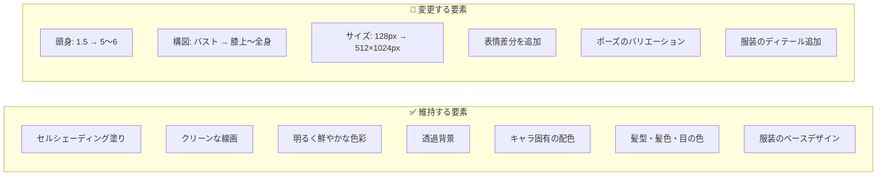
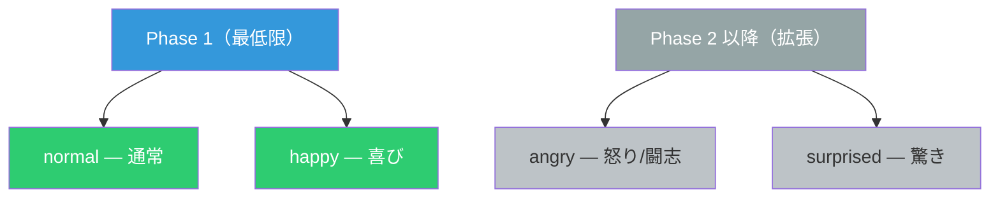
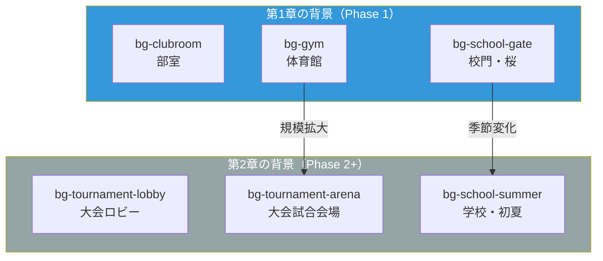
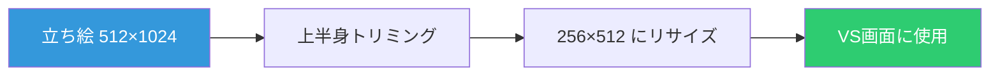
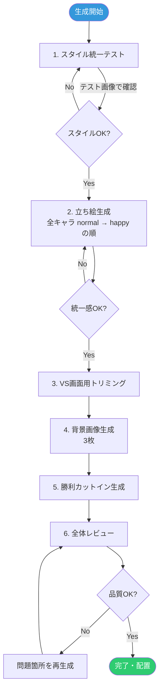

# 画像生成スタイルガイド（D-04）

> **対象**: Air Hockey ストーリーモードのビジュアルアセット全般
> **生成ツール**: Google Nanobanana2
> **ステータス**: Phase 0（設計）— 実際の画像生成は Phase 1 で実施

---

## 目次

1. [既存アイコンのスタイル分析](#1-既存アイコンのスタイル分析)
2. [アートスタイルの統一方針](#2-アートスタイルの統一方針)
3. [立ち絵の仕様](#3-立ち絵の仕様)
4. [表情差分の定義](#4-表情差分の定義)
5. [キャラクター別立ち絵プロンプト](#5-キャラクター別立ち絵プロンプト)
6. [背景画像の仕様](#6-背景画像の仕様)
7. [VS画面用イラストの仕様](#7-vs画面用イラストの仕様)
8. [勝利カットインの仕様](#8-勝利カットインの仕様)
9. [ファイル命名規則](#9-ファイル命名規則)
10. [全画像アセット一覧](#10-全画像アセット一覧)

---

## 1. 既存アイコンのスタイル分析

### 現行アイコンの特徴

| 項目 | 設定 |
|------|------|
| サイズ | 128×128px（表示時 64×64px、Retina 対応） |
| フォーマット | PNG（透過背景） |
| 頭身 | 約 1.5 頭身（チビ / SD） |
| 構図 | 3/4 ビュー、バストショット |
| 塗り | セルシェーディング（アニメ塗り） |
| 線画 | クリーンな線画（clean line art） |
| 色彩 | 明るく鮮やかな色使い（bright, vivid colors） |
| 背景 | 透明 |

### 既存プロンプトの共通構造

```
anime style chibi character portrait, [外見描写],
[表情], [服装], 3/4 view bust shot, clean line art,
cel-shaded, bright vivid colors, transparent background, 128x128 pixels
```

### アイコン → 立ち絵で維持する要素・変更する要素



**原則**: アイコンを見た人が「同じキャラだ」と認識できること。配色・髪型・服装の基本ラインは絶対に変えない。

---

## 2. アートスタイルの統一方針

### スタイルキーワード

| カテゴリ | 指定 |
|---------|------|
| ジャンル | アニメスタイル / 少年漫画風 |
| 塗り | セルシェーディング（フラットな影 + ハイライト） |
| 線画 | やや太めのクリーンライン |
| 色調 | 高彩度・明るいトーン（少年漫画の表紙イメージ） |
| 雰囲気 | 爽やか・スポーティー・前向き |

### スタイル統一のルール

1. **同一セッション生成**: 全キャラの立ち絵は同一の生成設定で作成
2. **共通プロンプトベース**: 後述のテンプレートをすべてのキャラに適用
3. **色温度の統一**: 暖色系キャラ（ヒロ・タクマ）も寒色系キャラ（アキラ・ミサキ）も同じ光源設定
4. **線の太さ**: 全キャラ共通（アウトライン太め、内部線やや細め）

### ネガティブプロンプト（全アセット共通）

```
realistic, photorealistic, 3D render, dark atmosphere,
gloomy, horror, gore, text, watermark, signature,
blurry, low quality, deformed, extra limbs,
overly detailed background, noise, grain
```

---

## 3. 立ち絵の仕様

### 基本仕様

| 項目 | 仕様 |
|------|------|
| サイズ | 512×1024px（表示時は縮小） |
| フォーマット | PNG（透過背景） |
| 構図 | 膝上〜全身（キャラにより調整） |
| 頭身 | 5〜6頭身 |
| 視線 | やや正面向き（3/4 ビュー） |
| ライティング | 正面やや上からの柔らかい光 |

### 立ち絵プロンプトテンプレート

```
anime style character illustration, cel-shaded coloring,
clean bold outlines, [キャラの外見描写],
[表情指定], [服装詳細], [ポーズ指定],
knee-up to full body shot, 5.5 head proportions,
3/4 view facing slightly right, soft front lighting,
bright vivid colors, transparent background,
high quality, detailed
```

### 服装の方針

- **基本**: 各キャラのテーマカラーを反映したスポーツウェア
- **デザイン**: 白ベースにテーマカラーのライン or テーマカラーベースに白のアクセント
- **共通要素**: 右胸に小さなエアホッケー部のエンブレム（風のモチーフ）
- **個性**: キャラごとのアクセサリー（リストバンド、ヘアピン等）で差別化

---

## 4. 表情差分の定義

### 表情パターン一覧

| ID | 表情名 | 説明 | 用途 |
|----|--------|------|------|
| `normal` | 通常 | リラックスした自然な表情 | ダイアログ（デフォルト）、VS画面、図鑑 |
| `happy` | 喜び | 嬉しそうな笑顔、目が輝く | 勝利時ダイアログ、得点リアクション |
| `angry` | 怒り/闘志 | 眉を寄せ、瞳に炎 | 挑発時、負けそうな時、気合い |
| `surprised` | 驚き | 目を見開き、口が開く | 失点時、予想外の展開 |

### Phase 別の実装範囲



### 表情差分の生成方法

1. **ベース画像の生成**: `normal` 表情でキャラの全身立ち絵を生成
2. **表情差分の生成**: 同じシード/設定をベースに表情指定のみ変更して再生成
3. **整合性チェック**: 体のポーズ・服装が変わっていないことを確認
4. **微調整**: 必要に応じて表情部分のみ修正

---

## 5. キャラクター別立ち絵プロンプト

### 5-1. 蒼葉 アキラ（主人公）

| 項目 | 設定 |
|------|------|
| テーマカラー | 青 #3498db |
| 髪型・髪色 | 黒髪ショート |
| 目の色 | 茶色 |
| 体格 | 普通（165cm） |
| 服装 | 白スポーツウェア + 青ライン |
| アクセサリー | 右手首に青いリストバンド |

#### normal（通常）

```
anime style character illustration, cel-shaded coloring,
clean bold outlines, young boy age 15, short black hair,
brown eyes, calm confident expression with slight smile,
wearing white sports jersey with blue (#3498db) trim and lines,
blue wristband on right wrist, small wind emblem on chest,
relaxed standing pose with hands at sides,
knee-up shot, 5.5 head proportions,
3/4 view facing slightly right, soft front lighting,
bright vivid colors, transparent background,
high quality, detailed
```

#### happy（喜び）

```
anime style character illustration, cel-shaded coloring,
clean bold outlines, young boy age 15, short black hair,
brown eyes, bright joyful smile with sparkling eyes,
wearing white sports jersey with blue (#3498db) trim and lines,
blue wristband on right wrist, small wind emblem on chest,
energetic pose with right fist raised,
knee-up shot, 5.5 head proportions,
3/4 view facing slightly right, soft front lighting,
bright vivid colors, transparent background,
high quality, detailed
```

---

### 5-2. 日向 ヒロ（ステージ 1-1）

| 項目 | 設定 |
|------|------|
| テーマカラー | オレンジ #e67e22 |
| 髪型・髪色 | 茶髪ショート（毛先がハネている） |
| 目の色 | 緑 |
| 体格 | やや細身（172cm） |
| 服装 | オレンジスポーツウェア |
| アクセサリー | なし（飾らない性格を反映） |

#### normal（通常）

```
anime style character illustration, cel-shaded coloring,
clean bold outlines, young boy age 16, short messy brown hair
with spiky ends, green eyes, bright friendly grin,
wearing orange (#e67e22) sports jersey with white accents,
small wind emblem on chest,
casual standing pose with one hand on hip,
knee-up shot, 5.5 head proportions,
3/4 view facing slightly right, soft front lighting,
bright vivid colors, transparent background,
high quality, detailed
```

#### happy（喜び）

```
anime style character illustration, cel-shaded coloring,
clean bold outlines, young boy age 16, short messy brown hair
with spiky ends, green eyes, wide cheerful laugh with eyes closed,
wearing orange (#e67e22) sports jersey with white accents,
small wind emblem on chest,
excited pose with both arms raised in celebration,
knee-up shot, 5.5 head proportions,
3/4 view facing slightly right, soft front lighting,
bright vivid colors, transparent background,
high quality, detailed
```

---

### 5-3. 水瀬 ミサキ（ステージ 1-2）

| 項目 | 設定 |
|------|------|
| テーマカラー | 紫 #9b59b6 |
| 髪型・髪色 | 紫がかった黒髪ポニーテール |
| 目の色 | 紫 |
| 体格 | やや小柄（162cm） |
| 服装 | 紫スポーツウェア |
| アクセサリー | 紫のヘアゴム（ポニーテールをまとめている） |

#### normal（通常）

```
anime style character illustration, cel-shaded coloring,
clean bold outlines, young girl age 16,
purple-black hair in high ponytail, purple eyes,
smart calm expression with slight knowing smile,
wearing purple (#9b59b6) sports jersey with white accents,
purple hair tie on ponytail, small wind emblem on chest,
composed standing pose with arms crossed lightly,
knee-up shot, 5.5 head proportions,
3/4 view facing slightly right, soft front lighting,
bright vivid colors, transparent background,
high quality, detailed
```

#### happy（喜び）

```
anime style character illustration, cel-shaded coloring,
clean bold outlines, young girl age 16,
purple-black hair in high ponytail, purple eyes,
playful happy smile with one eye winking,
wearing purple (#9b59b6) sports jersey with white accents,
purple hair tie on ponytail, small wind emblem on chest,
cheerful pose with index finger raised as if making a point,
knee-up shot, 5.5 head proportions,
3/4 view facing slightly right, soft front lighting,
bright vivid colors, transparent background,
high quality, detailed
```

---

### 5-4. 鷹見 タクマ（ステージ 1-3）

| 項目 | 設定 |
|------|------|
| テーマカラー | 赤 #c0392b |
| 髪型・髪色 | 黒髪オールバック |
| 目の色 | 赤茶 |
| 体格 | がっしり（180cm） |
| 服装 | 赤スポーツウェア |
| アクセサリー | 赤いヘッドバンド（試合時に着用） |

#### normal（通常）

```
anime style character illustration, cel-shaded coloring,
clean bold outlines, young man age 17,
short slicked-back black hair, sharp reddish-brown eyes,
stern dignified expression with slight composure,
wearing red (#c0392b) sports jersey with white accents,
red headband, small wind emblem on chest,
strong standing pose with arms crossed over chest,
knee-up shot, 5.5 head proportions,
3/4 view facing slightly right, soft front lighting,
bright vivid colors, transparent background,
high quality, detailed
```

#### happy（喜び）

```
anime style character illustration, cel-shaded coloring,
clean bold outlines, young man age 17,
short slicked-back black hair, sharp reddish-brown eyes,
proud satisfied smile with approving nod,
wearing red (#c0392b) sports jersey with white accents,
red headband, small wind emblem on chest,
confident pose with one fist clenched at side and thumbs up,
knee-up shot, 5.5 head proportions,
3/4 view facing slightly right, soft front lighting,
bright vivid colors, transparent background,
high quality, detailed
```

---

### 5-5. 柊 ユウ（解説役）

| 項目 | 設定 |
|------|------|
| テーマカラー | 緑 #2ecc71 |
| 髪型・髪色 | 黒髪マッシュ |
| 目の色 | 濃い緑 |
| 体格 | 小柄（160cm） |
| 服装 | 緑スポーツウェア |
| アクセサリー | 丸メガネ、首からストップウォッチを下げている |

#### normal（通常）

```
anime style character illustration, cel-shaded coloring,
clean bold outlines, young boy age 15,
black mushroom-cut hair, dark green eyes,
round glasses, calm analytical expression,
wearing green (#2ecc71) sports jersey with white accents,
stopwatch hanging from neck strap, small wind emblem on chest,
standing pose with one hand holding stopwatch,
knee-up shot, 5.5 head proportions,
3/4 view facing slightly right, soft front lighting,
bright vivid colors, transparent background,
high quality, detailed
```

#### happy（喜び）

```
anime style character illustration, cel-shaded coloring,
clean bold outlines, young boy age 15,
black mushroom-cut hair, dark green eyes,
round glasses, gentle pleased smile with slight blush,
wearing green (#2ecc71) sports jersey with white accents,
stopwatch hanging from neck strap, small wind emblem on chest,
happy pose adjusting glasses with one hand,
knee-up shot, 5.5 head proportions,
3/4 view facing slightly right, soft front lighting,
bright vivid colors, transparent background,
high quality, detailed
```

---

### 5-6. 春日 ソウタ（フリー対戦 Easy / ルーキー）

| 項目 | 設定 |
|------|------|
| テーマカラー | ライム #27ae60 |
| 髪型・髪色 | 金髪ぼさぼさ |
| 目の色 | 青 |
| 体格 | 普通（168cm） |
| 服装 | 緑スポーツウェア |
| アクセサリー | なし |

#### normal（通常）

```
anime style character illustration, cel-shaded coloring,
clean bold outlines, young boy age 15,
messy blonde hair, blue eyes,
gentle easygoing smile with relaxed expression,
wearing green (#27ae60) sports jersey with white accents,
small emblem on chest,
relaxed standing pose with hands in jersey pockets,
knee-up shot, 5.5 head proportions,
3/4 view facing slightly right, soft front lighting,
bright vivid colors, transparent background,
high quality, detailed
```

#### happy（喜び）

```
anime style character illustration, cel-shaded coloring,
clean bold outlines, young boy age 15,
messy blonde hair, blue eyes,
surprised happy expression with wide open mouth,
wearing green (#27ae60) sports jersey with white accents,
small emblem on chest,
excited pose scratching back of head sheepishly,
knee-up shot, 5.5 head proportions,
3/4 view facing slightly right, soft front lighting,
bright vivid colors, transparent background,
high quality, detailed
```

---

### 5-7. 秋山 ケンジ（フリー対戦 Normal / レギュラー）

| 項目 | 設定 |
|------|------|
| テーマカラー | ネイビー #2c3e50 |
| 髪型・髪色 | 茶髪スポーツ刈り |
| 目の色 | 茶色 |
| 体格 | がっしり（175cm） |
| 服装 | 青スポーツウェア |
| アクセサリー | 額にスポーツヘッドバンド |

#### normal（通常）

```
anime style character illustration, cel-shaded coloring,
clean bold outlines, young boy age 16,
short brown crew cut hair, brown eyes,
sports headband on forehead,
serious but friendly expression with determined look,
wearing navy blue (#2c3e50) sports jersey with white accents,
small emblem on chest,
firm standing pose with fists clenched at sides,
knee-up shot, 5.5 head proportions,
3/4 view facing slightly right, soft front lighting,
bright vivid colors, transparent background,
high quality, detailed
```

#### happy（喜び）

```
anime style character illustration, cel-shaded coloring,
clean bold outlines, young boy age 16,
short brown crew cut hair, brown eyes,
sports headband on forehead,
relieved happy smile with eyes slightly narrowed,
wearing navy blue (#2c3e50) sports jersey with white accents,
small emblem on chest,
happy pose with right arm flexing in triumph,
knee-up shot, 5.5 head proportions,
3/4 view facing slightly right, soft front lighting,
bright vivid colors, transparent background,
high quality, detailed
```

---

### 5-8. 氷室 レン（フリー対戦 Hard / エース）

| 項目 | 設定 |
|------|------|
| テーマカラー | 黒+赤 #2c3e50 / #e74c3c |
| 髪型・髪色 | 銀髪ウルフカット |
| 目の色 | 灰色 |
| 体格 | やや細身で長身（178cm） |
| 服装 | 黒スポーツウェア + 赤ライン |
| アクセサリー | 左耳に小さなピアス（銀） |

#### normal（通常）

```
anime style character illustration, cel-shaded coloring,
clean bold outlines, young man age 17,
silver wolf-cut hair, sharp gray eyes,
cool confident expression with slight smirk,
wearing black sports jersey with red (#e74c3c) trim and lines,
small silver earring on left ear, emblem on chest,
composed standing pose with one hand in pocket,
knee-up shot, 5.5 head proportions,
3/4 view facing slightly right, soft front lighting,
bright vivid colors, transparent background,
high quality, detailed
```

#### happy（喜び）

```
anime style character illustration, cel-shaded coloring,
clean bold outlines, young man age 17,
silver wolf-cut hair, sharp gray eyes,
subtle satisfied smile with eyes showing respect,
wearing black sports jersey with red (#e74c3c) trim and lines,
small silver earring on left ear, emblem on chest,
acknowledging pose with slight head tilt,
knee-up shot, 5.5 head proportions,
3/4 view facing slightly right, soft front lighting,
bright vivid colors, transparent background,
high quality, detailed
```

---

### 5-9. 第2章新キャラクター（概要プロンプト）

> 第2章の実装時に詳細を確定する。ここでは方向性のみ記載。

#### 風早 リク（天嶺高校 / スピードスター）

| 項目 | 設定 |
|------|------|
| テーマカラー | 黄 #f39c12 |
| 髪型・髪色 | 明るい茶髪のツンツンヘア（ワックスで立てている） |
| 目の色 | 琥珀色 |
| 体格 | 細身で筋肉質（175cm） |
| 服装 | 黄色スポーツウェア（天嶺高校ユニ） |
| アクセサリー | 黄色いスポーツバンダナ（額に巻いている） |
| 表情の方向性 | 自信家で挑戦的、歯を見せた笑み |

```
anime style character illustration, cel-shaded coloring,
clean bold outlines, young boy age 16,
bright brown spiky hair styled up with wax, amber eyes,
bold challenging grin showing teeth,
wearing yellow (#f39c12) sports jersey with white accents,
yellow sports bandana tied on forehead,
dynamic standing pose leaning forward slightly,
knee-up shot, 5.5 head proportions,
3/4 view facing slightly right, soft front lighting,
bright vivid colors, transparent background,
high quality, detailed
```

#### 白波 カナタ（碧波学院 / トリックスター）

| 項目 | 設定 |
|------|------|
| テーマカラー | ティール #1abc9c |
| 髪型・髪色 | 水色がかった黒髪のミディアムヘア（片目にかかるサイドバング） |
| 目の色 | 薄い水色 |
| 体格 | 中肉中背（168cm） |
| 服装 | ティールスポーツウェア（碧波学院ユニ） |
| アクセサリー | 左手首にミサンガ（部員で揃いのもの） |
| 表情の方向性 | 飄々とした余裕の微笑み |

```
anime style character illustration, cel-shaded coloring,
clean bold outlines, young boy age 16,
blue-tinted black medium-length hair with side bangs covering one eye, light blue eyes,
relaxed mysterious smile with half-lidded eyes,
wearing teal (#1abc9c) sports jersey with white accents,
friendship bracelet (misanga) on left wrist,
casual standing pose with hand behind head,
knee-up shot, 5.5 head proportions,
3/4 view facing slightly right, soft front lighting,
bright vivid colors, transparent background,
high quality, detailed
```

#### 朝霧 シオン（銀嶺学園 / アダプター）

| 項目 | 設定 |
|------|------|
| テーマカラー | 白銀 #bdc3c7 |
| 髪型・髪色 | 銀灰色のセミロング（後ろで一つにまとめている） |
| 目の色 | 淡いグレー |
| 体格 | すらりとした長身（170cm） |
| 服装 | 白+銀スポーツウェア（銀嶺学園ユニ） |
| アクセサリー | 左耳に小さなシルバーのピアス |
| 表情の方向性 | 冷静で観察するような眼差し |

```
anime style character illustration, cel-shaded coloring,
clean bold outlines, young person age 16,
silver-gray semi-long hair tied back in a low ponytail,
pale gray eyes, small silver earring on left ear,
calm observing expression with piercing analytical gaze,
wearing white and silver (#bdc3c7) sports jersey,
composed standing pose with arms behind back,
knee-up shot, 5.5 head proportions,
3/4 view facing slightly right, soft front lighting,
bright vivid colors, transparent background,
high quality, detailed
```

---

## 6. 背景画像の仕様

### 基本仕様

| 項目 | 仕様 |
|------|------|
| サイズ | 450×900px（ゲーム内部解像度に合わせる） |
| フォーマット | WebP（ファイルサイズ軽減） |
| スタイル | アニメ背景風、柔らかいライティング |
| 人物 | 含めない（立ち絵を重ねるため） |

### 背景共通プロンプトテンプレート

```
anime style background illustration, soft lighting,
warm color palette, no characters, no text,
[場所の詳細描写], [時間帯・天候],
[季節の要素], clean detailed background art,
vertical composition 450x900,
high quality, studio ghibli inspired atmosphere
```

### 背景ネガティブプロンプト

```
characters, people, text, watermark, signature,
photorealistic, 3D render, dark gloomy atmosphere,
blurry, low quality, noise
```

---

### 6-1. 第1章の背景（Phase 1 で生成 — 3枚）

#### bg-clubroom（部室）

| 項目 | 設定 |
|------|------|
| ID | `bg-clubroom` |
| 場面 | エアホッケー部の部室 |
| 使用箇所 | ステージ 1-1, 1-2 の試合前後ダイアログ |
| 時間帯 | 放課後（夕方の柔らかい光） |
| 季節 | 春（4月） |

```
anime style background illustration, soft afternoon lighting,
warm color palette, no characters, no text,
cozy school club room on second floor corner room,
two air hockey tables in center of room,
large windows on two walls letting in warm golden sunlight,
bulletin board with tournament brackets and team photos,
shelves with trophies and equipment,
sports bags on floor near wall,
spring afternoon, cherry blossom petals visible through window,
clean detailed background art, vertical composition 450x900,
high quality, inviting atmosphere
```

#### bg-gym（体育館）

| 項目 | 設定 |
|------|------|
| ID | `bg-gym` |
| 場面 | 体育館（部長戦の舞台） |
| 使用箇所 | ステージ 1-3 の試合前後ダイアログ |
| 時間帯 | 日中（明るい照明） |
| 季節 | 春（4月） |

```
anime style background illustration, bright indoor lighting,
warm color palette, no characters, no text,
spacious school gymnasium with high ceiling,
professional air hockey table in center spotlight,
bleacher seats on both sides,
banners hanging from ceiling with school colors,
polished wooden floor reflecting light,
dramatic atmosphere for an important match,
clean detailed background art, vertical composition 450x900,
high quality, exciting competitive atmosphere
```

#### bg-school-gate（校門・桜）

| 項目 | 設定 |
|------|------|
| ID | `bg-school-gate` |
| 場面 | 校門前の桜並木 |
| 使用箇所 | チャプタータイトル、TO BE CONTINUED |
| 時間帯 | 朝〜昼（明るい光） |
| 季節 | 春（4月・満開の桜） |

```
anime style background illustration, bright spring sunlight,
warm pink and white color palette, no characters, no text,
school entrance gate with cherry blossom trees in full bloom,
stone path leading to school building on a hill,
petals floating in gentle breeze,
clear blue sky with soft white clouds,
fresh green leaves mixed with pink blossoms,
clean detailed background art, vertical composition 450x900,
high quality, hopeful new beginning atmosphere
```

---

### 6-2. 第2章の背景（方針）

> 第2章実装時に詳細プロンプトを確定する。ここでは方向性と必要枚数を記載。

#### 第2章で追加が必要な背景

| ID | 場面 | 使用箇所 | 季節 | イメージ |
|----|------|---------|------|---------|
| `bg-tournament-lobby` | 大会会場ロビー | 2-1 / 2-2 試合前 | 初夏（6月） | 広いロビー、大会バナー、緊張感のある雰囲気 |
| `bg-tournament-arena` | 大会試合会場 | 2-2〜2-4 試合前後 | 初夏（6月） | 正式な競技場、観客席満席、照明が眩しい |
| `bg-school-summer` | 学校（初夏） | 2-1 練習試合前 | 初夏（6月） | 新緑の校庭、夏の日差し、入道雲 |



---

## 7. VS画面用イラストの仕様

### 基本仕様

| 項目 | 仕様 |
|------|------|
| サイズ | 256×512px |
| フォーマット | PNG（透過背景） |
| 構図 | 半身（腰上）、やや正面向き |
| 表情 | 闘志のある表情（VS用特別表情） |
| ポーズ | 戦闘前の構え（キャラごとに異なる） |

### Phase 1 の代用方針

Phase 1 では立ち絵のトリミング＋表情差し替えで代用する：



1. 立ち絵（512×1024px）の上半身部分を切り出し
2. 256×512px にリサイズ
3. 表情は `normal` ベースで闘志を感じるものを選択

### 将来の専用イラスト方針（Phase 2 以降）

- 立ち絵とは異なる「バトルポーズ」を設定
- 背景にキャラのテーマカラーのオーラエフェクトを追加
- 対戦相手との対比が映える構図

---

## 8. 勝利カットインの仕様

### 基本仕様

| 項目 | 仕様 |
|------|------|
| サイズ | 450×400px |
| フォーマット | PNG |
| Phase 1 枚数 | 1枚（第1章クリア時用） |

### 第1章クリア時カットイン

**構図案**: アキラが中央で拳を突き上げ、背景にヒロ・ミサキ・タクマ・ユウが笑顔で見守る

```
anime style victory illustration, cel-shaded coloring,
clean bold outlines, dynamic composition,
center: young boy (Akira) with short black hair, brown eyes,
triumphant expression, right fist raised high in the air,
wearing white sports jersey with blue trim,
background: four teammates cheering and smiling,
(orange jersey boy, purple jersey girl, red jersey tall boy, green jersey boy with glasses),
confetti and sparkle effects,
warm golden lighting from above,
bright vivid celebratory colors,
high quality, detailed, 450x400 pixels
```

### 第2章用カットイン（方針のみ）

- **構図案**: アキラが地区大会のトロフィーを掲げ、チームメイト全員で記念写真風
- 詳細は第2章実装時に確定

---

## 9. ファイル命名規則

### 立ち絵

```
{キャラID}-{表情ID}.png
```

| 例 | 説明 |
|----|------|
| `akira-normal.png` | アキラの通常表情 |
| `akira-happy.png` | アキラの喜び表情 |
| `hiro-normal.png` | ヒロの通常表情 |
| `takuma-angry.png` | タクマの怒り表情（Phase 2 以降） |

### VS画面用

```
{キャラID}-vs.png
```

### 背景

```
{背景ID}.webp
```

### 勝利カットイン

```
victory-{章番号}.png
```

### ディレクトリ構成

```
public/assets/
├── characters/          # 既存アイコン（128×128px）
│   ├── akira.png
│   ├── hiro.png
│   └── ...
├── portraits/           # 立ち絵（512×1024px）★ Phase 1 で新設
│   ├── akira-normal.png
│   ├── akira-happy.png
│   ├── hiro-normal.png
│   ├── hiro-happy.png
│   └── ...
├── vs/                  # VS画面用（256×512px）★ Phase 1 で新設
│   ├── akira-vs.png
│   ├── hiro-vs.png
│   └── ...
├── backgrounds/         # 背景画像（450×900px）★ Phase 1 で新設
│   ├── bg-clubroom.webp
│   ├── bg-gym.webp
│   └── bg-school-gate.webp
└── cutins/              # カットイン（450×400px）★ Phase 1 で新設
    └── victory-ch1.png
```

---

## 10. 全画像アセット一覧

### Phase 1 で生成するアセット

#### 立ち絵（portraits/）

| ファイル名 | キャラ | 表情 | サイズ | フォーマット |
|-----------|--------|------|--------|------------|
| `akira-normal.png` | アキラ | 通常 | 512×1024 | PNG |
| `akira-happy.png` | アキラ | 喜び | 512×1024 | PNG |
| `hiro-normal.png` | ヒロ | 通常 | 512×1024 | PNG |
| `hiro-happy.png` | ヒロ | 喜び | 512×1024 | PNG |
| `misaki-normal.png` | ミサキ | 通常 | 512×1024 | PNG |
| `misaki-happy.png` | ミサキ | 喜び | 512×1024 | PNG |
| `takuma-normal.png` | タクマ | 通常 | 512×1024 | PNG |
| `takuma-happy.png` | タクマ | 喜び | 512×1024 | PNG |
| `yuu-normal.png` | ユウ | 通常 | 512×1024 | PNG |
| `yuu-happy.png` | ユウ | 喜び | 512×1024 | PNG |
| `souta-normal.png` | ソウタ | 通常 | 512×1024 | PNG |
| `souta-happy.png` | ソウタ | 喜び | 512×1024 | PNG |
| `kenji-normal.png` | ケンジ | 通常 | 512×1024 | PNG |
| `kenji-happy.png` | ケンジ | 喜び | 512×1024 | PNG |
| `ren-normal.png` | レン | 通常 | 512×1024 | PNG |
| `ren-happy.png` | レン | 喜び | 512×1024 | PNG |

**小計: 16枚**

#### VS画面用（vs/）— Phase 1 は立ち絵トリミングで代用

| ファイル名 | キャラ | サイズ | フォーマット |
|-----------|--------|--------|------------|
| `akira-vs.png` | アキラ | 256×512 | PNG |
| `hiro-vs.png` | ヒロ | 256×512 | PNG |
| `misaki-vs.png` | ミサキ | 256×512 | PNG |
| `takuma-vs.png` | タクマ | 256×512 | PNG |
| `souta-vs.png` | ソウタ | 256×512 | PNG |
| `kenji-vs.png` | ケンジ | 256×512 | PNG |
| `ren-vs.png` | レン | 256×512 | PNG |

**小計: 7枚**（トリミング生成）

#### 背景（backgrounds/）

| ファイル名 | 場面 | サイズ | フォーマット |
|-----------|------|--------|------------|
| `bg-clubroom.webp` | 部室 | 450×900 | WebP |
| `bg-gym.webp` | 体育館 | 450×900 | WebP |
| `bg-school-gate.webp` | 校門・桜 | 450×900 | WebP |

**小計: 3枚**

#### カットイン（cutins/）

| ファイル名 | 内容 | サイズ | フォーマット |
|-----------|------|--------|------------|
| `victory-ch1.png` | 第1章勝利 | 450×400 | PNG |

**小計: 1枚**

---

### Phase 1 合計

| カテゴリ | 枚数 |
|---------|------|
| 立ち絵 | 16枚 |
| VS画面用 | 7枚（トリミング生成） |
| 背景 | 3枚 |
| カットイン | 1枚 |
| **合計** | **27枚**（実生成は20枚） |

---

### 第2章で追加予定のアセット（概算）

| カテゴリ | 内容 | 枚数（概算） |
|---------|------|------------|
| 立ち絵 | 新キャラ3名 × 2表情 | 6枚 |
| VS画面用 | 新キャラ3名 | 3枚 |
| 背景 | 大会ロビー・会場・学校夏 | 3枚 |
| カットイン | 第2章勝利 | 1枚 |
| **合計** | | **13枚** |

---

## 生成ワークフロー

Phase 1 で実際に画像を生成する際の推奨手順：



### 生成時の注意事項

1. **セッション統一**: キャラの立ち絵は必ず同一セッション（同一設定）で生成する
2. **順序**: `normal` を全キャラ分先に生成 → その後 `happy` を生成（スタイルのブレを防ぐ）
3. **品質チェック**: 生成後、アイコンと並べて「同じキャラ」と認識できるか確認
4. **色の再現**: テーマカラーが正確に反映されているか確認（特にヘックスコード指定の色）
5. **透過背景**: PNG の背景が確実に透過されていることを確認

---

## 変更履歴

| 日付 | 内容 |
|------|------|
| 2026-03-11 | 初版作成（Phase 0 / P0-04） |
| 2026-03-11 | P0-05 整合性レビュー: アクセサリ統一（D-02準拠）、学校名変更、新キャラ外見修正 |
