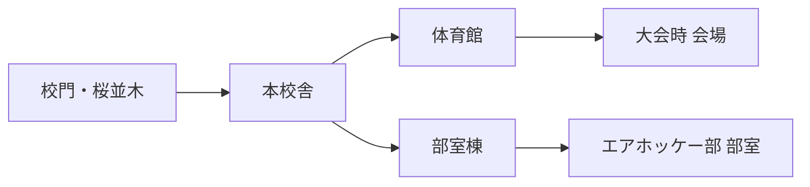
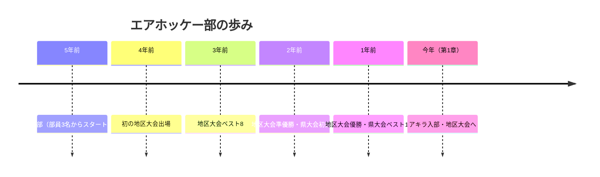
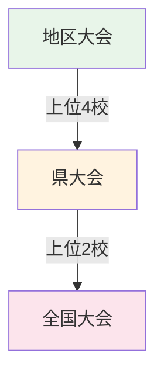
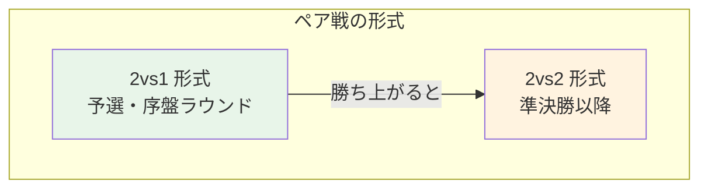
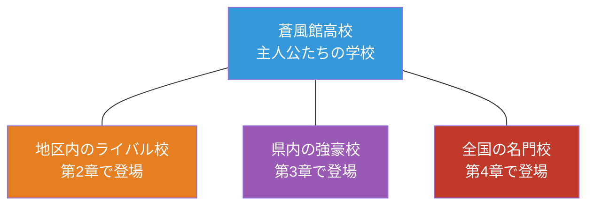

# 世界観設定書（D-01）

## 概要

本ドキュメントは、エアホッケーゲーム「AIR HOCKEY」の舞台となる世界観を定義する。
Phase 1 の背景画像制作、第2章以降のストーリー展開の土台となる。

---

## 1. 舞台設定

### 1.1 学校情報

| 項目 | 設定 |
|------|------|
| **正式名称** | 蒼風館高等学校（そうふうかんこうとうがっこう） |
| **略称** | 蒼風館（そうふうかん）、蒼風（そうふう） |
| **種別** | 私立（共学） |
| **生徒数** | 約600名（1学年200名程度） |
| **校風** | 「自由と挑戦」を校訓に掲げる。文武両道で部活動が盛んだが、進学にも力を入れている |
| **所在地** | 地方都市の郊外。丘の上に建つキャンパスで、周囲には並木道と公園がある |
| **時代** | 現代（202X年） |

### 1.2 学校の特徴

- 「生徒の自主性を重んじる」校風で、ユニークな部活動が多い
- 校舎は比較的新しく、清潔感のある明るい雰囲気
- 丘の上の立地のため、校門からの並木道と見晴らしの良い景色が印象的
- 近年、スポーツ系の部活がいくつか県大会で好成績を収めている

### 1.3 校内の主要な場所



| 場所 | 背景ID | 描写 |
|------|--------|------|
| **校門・桜並木** | `bg-school-gate` | 丘の中腹にある校門。春は桜が咲き誇り、新入生を迎える象徴的な場所。石造りの門柱に「蒼風館高等学校」の銘板 |
| **部室** | `bg-clubroom` | 部室棟の2階、角部屋。エアホッケー台が2台置かれた広めの部室。窓が大きく、午後の陽光が差し込む。壁には大会のポスターやトーナメント表が貼られている |
| **体育館** | `bg-gym` | 学校の体育館。大会時にはエアホッケー台が複数設置される。観客席付きで、地区大会の会場にもなる |

---

## 2. エアホッケー部の設定

### 2.1 基本情報

| 項目 | 設定 |
|------|------|
| **正式名称** | エアホッケー部 |
| **創部** | 5年前（現顧問の着任がきっかけ） |
| **部員数** | 5名（主要キャラのみ。少数精鋭の部活） |
| **活動日** | 平日 月・水・金の放課後 + 大会前は毎日 |
| **活動場所** | 部室棟2階 エアホッケー部室（メイン）、体育館（大会練習時） |
| **顧問** | あり（名前は未設定。普段は口を出さないが、大会の引率や部の存続に関わる場面で登場） |

### 2.2 部の歴史と実績



- 創部5年目の「そこそこ実績がある部活」
- 少数精鋭で5名。部員全員が大会にエントリーできる規模
- 地区大会では上位常連だが、県大会では上位進出できていない
- 部長タクマの代で県大会上位を狙えるレベルに成長
- 学校内では「知る人ぞ知る強豪」というポジション

### 2.3 部室の詳細

Phase 1 の背景画像 `bg-clubroom` の制作に直結する設定。

| 要素 | 描写 |
|------|------|
| **広さ** | 教室の約1.5倍。エアホッケー台2台が余裕を持って置ける |
| **エアホッケー台** | 公式サイズの台が2台。1台は練習用、1台は試合用として使い分け |
| **窓** | 南向きの大きな窓。午後は陽光が差し込み、明るい雰囲気 |
| **壁面** | 大会ポスター、過去の成績表、トーナメント表が貼られている |
| **その他** | 部員のロッカー、作戦ボード（ホワイトボード）、飲み物用の小型冷蔵庫 |
| **雰囲気** | 活気があるが整理整頓されている。タクマの部長としての規律が感じられる |

---

## 3. 大会制度

### 3.1 大会の階層構造



> ※ 国際大会（世界大会等）は将来的に検討。現時点では国内3段階の構造で設計する。

### 3.2 国内大会の詳細

| 大会 | 規模 | 時期 | 形式 | 備考 |
|------|------|------|------|------|
| **地区大会** | 参加校 12〜16校 | 6月（夏季）/ 11月（秋季） | 個人戦 + ペア戦 | 年2回開催。上位4校が県大会へ |
| **県大会** | 参加校 20〜30校 | 8月（夏季）/ 1月（冬季） | 個人戦 + ペア戦 | 上位2校が全国大会へ |
| **全国大会** | 参加校 48校 | 3月（春の全国大会） | 個人戦 + ペア戦 | 全都道府県の代表が集う |

### 3.3 試合形式

#### 個人戦
- 1対1のトーナメント方式
- 5点先取（予選は3点先取）
- 各校から最大3名がエントリー

#### ペア戦（協力プレイ）
- 2人1組で同じサイドに立ち、協力して1人の相手（または相手ペア）と戦う
- 試合形式は大会のラウンドによって異なる:



| 形式 | 人数 | 特徴 | ゲーム的な対応 |
|------|------|------|--------------|
| **2vs1** | ペア vs 個人 | 予選で採用。ペア側が2つのマレットを操作 | 協力プレイモード（2人で1体のCPUに挑む） |
| **2vs2** | ペア vs ペア | 上位ラウンドで採用。両サイドとも2人ずつ | 将来的な拡張枠 |

- ペアの組み合わせは自由（同校でなくてもよい大会もある）
- 5名の部員で個人戦3枠 + ペア戦1組（2名）= **全員が出場可能**

### 3.4 ペア戦がストーリーに与える意味

> ペア戦は「友情・協力」というテーマをゲーム体験に直結させる重要な要素。


- 第1章では部内で1対1の対戦をし、個人の実力を磨く
- 第2章以降の大会では、個人戦とペア戦の両方が登場
- ペア戦で「あの対戦相手だったキャラと今度は味方として協力する」という展開が可能
- ゲーム的には Phase 3 の「協力プレイモード」と連動

---

## 4. 時系列

### 4.1 ストーリーの年間スケジュール

```mermaid
gantt
    title ストーリー年間スケジュール
    dateFormat  MM
    axisFormat  %m月

    section 第1章
    入部・部内対戦        :ch1, 04, 30d

    section 第2章
    地区大会編            :ch2, 06, 30d

    section 第3章（構想）
    県大会編              :ch3, 08, 30d

    section 第4章（構想）
    全国大会編            :ch4, 01, 60d
```



### 4.2 各章の時期と季節感

| 章 | 時期 | 季節 | 背景イメージ | テーマ |
|----|------|------|-------------|--------|
| **第1章** | 4月 | 春 | 桜並木、新緑、明るい日差し | 入部・仲間との出会い |
| **第2章** | 6月 | 初夏 | 梅雨明けの青空、白い入道雲 | 初めての公式戦（地区大会） |
| **第3章**（構想） | 8月 | 夏 | 真夏の日差し、セミの声 | 県大会・強敵との対決 |
| **第4章**（構想） | 1月 | 冬 | 冬の澄んだ空気、雪景色 | 全国大会・日本の頂点へ |

> ※ 全国大会以降の展開（世界大会等）は将来的に検討。

### 4.3 第1章の時系列（詳細）

| 時期 | 出来事 | 対応ステージ |
|------|--------|-------------|
| 4月上旬 | アキラが蒼風館に入学。エアホッケー部の新歓を見て興味を持つ | — |
| 4月中旬 | 入部。ヒロが最初の相手として手合わせ | ステージ 1-1 |
| 4月下旬 | ミサキに挑戦。テクニカルな戦い方を学ぶ | ステージ 1-2 |
| 4月末〜5月 | 部長タクマに挑戦。正式メンバーとして認められる | ステージ 1-3 |

---

## 5. 世界観のトーンとルール

### 5.1 作品のトーン

| 要素 | 方針 |
|------|------|
| **ジャンル** | 少年スポーツ（友情・努力・成長） |
| **明るさ** | 基本的に明るくポジティブ。暗い展開は避ける |
| **リアリティ** | 楽しさ優先。エアホッケーの物理や競技ルールは現実に厳密に従わない |
| **緊張感** | 試合中は緊張感があるが、試合後は和やかな雰囲気に戻る |
| **成長** | 主人公アキラが仲間や対戦相手から学び、着実に強くなっていく |

### 5.2 世界観のルール

- **エアホッケーはメジャー競技**: この世界では高校エアホッケーが一定の認知度を持つスポーツとして描かれる（現実のマイナー競技という設定は使わない）
- **特殊能力はなし**: 超人的な技や魔法のような要素はない。ただし「得意技」には印象的な名前をつけてよい
- **フィールドの多様性はゲーム的演出**: ゲーム内の多様なフィールド（障害物あり等）は「練習用の特殊コート」や「大会の特別ルール」として世界観に組み込む
- **アイテムの存在**: ゲーム内のアイテム（スピードアップ等）は世界観上は明示的に説明せず、あくまでゲーム的な要素として扱う

### 5.3 フィールドと世界観の対応

既存の6フィールドを世界観に位置づける。

| フィールドID | ゲーム内名称 | 世界観上の解釈 |
|-------------|-------------|---------------|
| `classic` | Original | 標準のエアホッケー台。部室の練習台 |
| `wide` | Wide | 横幅が広い大型台。テクニカルな練習用 |
| `narrow` | Narrow | 幅の狭い台。スピード重視の練習用 |
| `pillars` | Pillars | 障害物ありの台。反射角を鍛える特訓用 |
| `multi-goal` | Multi Goal | 複数ゴールの台。判断力を鍛える練習用 |
| `speed` | Speed | 高速仕様の台。反応速度を鍛える練習用 |

---

## 6. 拡張ポイント

第2章以降のストーリー展開を自然に受け入れるための構造。

### 6.1 他校の存在



- 他校のキャラクターは各章で登場させることで、世界を段階的に広げる
- 各校に特色あるプレイスタイルや校風を設定し、キャラクターの個性に紐づける

### 6.2 部員構成と大会出場の対応

5名の部員全員が大会に出場できる構造になっている。

```mermaid
graph LR
    subgraph 蒼風館エアホッケー部（5名）
        A[タクマ<br/>3年・部長]
        B[ヒロ<br/>2年]
        C[ミサキ<br/>2年]
        D[アキラ<br/>1年・主人公]
        E[5人目<br/>※P0-02で確定]
    end

    subgraph 大会エントリー
        F[個人戦<br/>3名出場]
        G[ペア戦<br/>1組（2名）出場]
    end

    A --> F
    B --> F
    D --> F
    C --> G
    E --> G
```

> ※ 誰がどの種目に出場するかはストーリー展開によって変動する。上記は一例。

### 6.3 拡張可能な要素

| 要素 | 現在の設定 | 拡張の余地 |
|------|-----------|-----------|
| 部員 | 5名（全員が主要キャラ） | 新入部員、OB/OG の登場 |
| 大会 | 地区大会のみ具体化 | 県大会・全国大会、さらにその先 |
| 試合形式 | 個人戦 + ペア戦（2vs1） | 2vs2、特殊ルール戦 |
| 場所 | 学校内のみ | 他校、大会会場、合宿先 |
| 季節 | 春（第1章） | 四季を通じた展開 |
| 人間関係 | 部内の先輩後輩 | ライバル校との友情・協力、卒業と別れ |

---

## 改訂履歴

| 日付 | 内容 |
|------|------|
| 2026-03-11 | 初版作成 |
